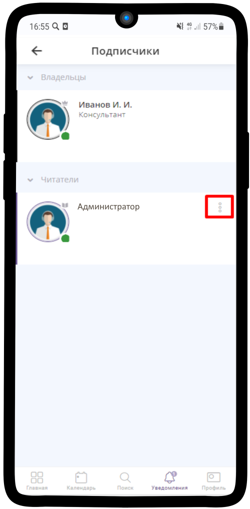

=========================================
Создание рабочего раздела сотрудника (МИК)
=========================================

Создание раздела
---------------------

После того, как Вы зарегистрировались (:ref:`introduction-label`) и создали свою **Визитку**, создадим для удобства пользования **Рабочий раздел**.

1. Перейдите на вкладку **Главная**

.. figure:: media/workplace/work_mimk1.png
    :scale: 42 %
    :alt: alternate text
    :align: center

-------------

2.  Нажмите на |точка| в верхнем правом углу

    .. |точка| image:: media/tochka.png
        :scale: 42 %

.. figure:: media/workplace/work_mimk2.png
    :scale: 42 %
    :alt: alternate text
    :align: center

-------------

3. Выберите **Добавить раздел**

.. figure:: media/workplace/work_mimk3.png
    :scale: 42 %
    :alt: alternate text
    :align: center

-------------

4. Укажите ранее созданную **Визитку** в поле **Представиться как**, впишите **название** раздела и нажмите на |галка|

    .. |галка| image:: media/galka.png
        :scale: 42 %

.. figure:: media/workplace/work_mimk4.png
    :scale: 42 %
    :alt: alternate text
    :align: center

-------------

5. Так выглядит созданный пустой раздел, куда мы сохраним необходимые для работы элементы

-------------

6. Перейдите по ссылке, которую получили от Администратора. Перед вами откроется страница Онлайн-школы. В правом верхнем углу нажмите на |точка|.

.. figure:: media/workplace/mpz11.png
    :scale: 42 %
    :alt: alternate text
    :align: center

-------------

7. Нажмите на **Сохранить в**

-------------

8. Выберите Ваше **Рабочее место**

-------------

9. Нажмите **Сохранить**

-------------
10. Откройте заметку **Сотрудники**

.. figure:: media/workplace/mpz3.png
    :scale: 42 %
    :alt: alternate text
    :align: center

-------------

11.  Выберите заметку **Менеджеры индивидуальных консультаций**

-------------

12. Найдите Ваш ресурс. И аналогично пунктам 6-9 сохраните Ваш рабочий ресурс в **Рабочее место** 

-------------

-------------

.. figure:: media/workplace/work_mimk12.png
    :scale: 42 %
    :alt: alternate text
    :align: center

-------------

13. Ваше рабочее место готово!

-------------

Права доступа
-------------------

Чтобы Вы могли редактировать своё расписание и принимать заявки, нужно получить права доступа, а также передать права доступа Администратору.

1. После того, как Вы сохраните необходимые для работы элементы, Администратор также сохранит Вашу визитку в страницу Онлайн-школы. Перейдите во вкладку **Уведомления**. Нажмите на имя пользователя, который сохранил Ваш элемент

-------------

2. Нажмите на |точка| рядом с именем Администратора

-------------

3. Выберите **Сделать менеджером**

.. figure:: media/workplace/res3.png
    :scale: 42 %
    :alt: alternate text
    :align: center

-------------