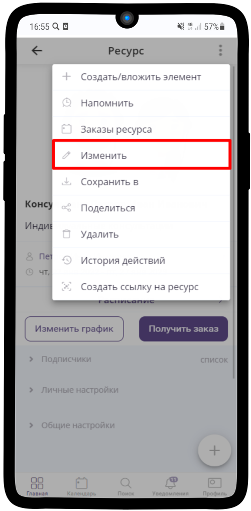
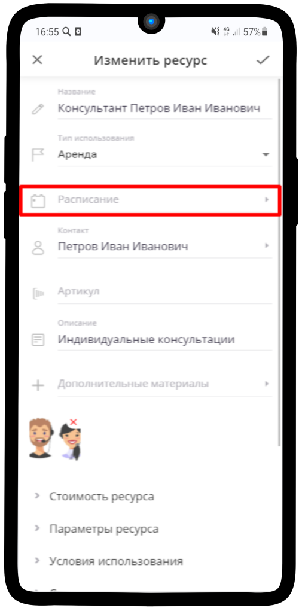
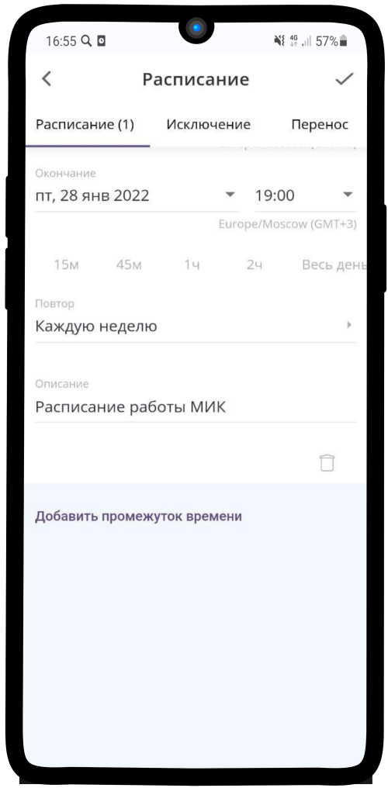
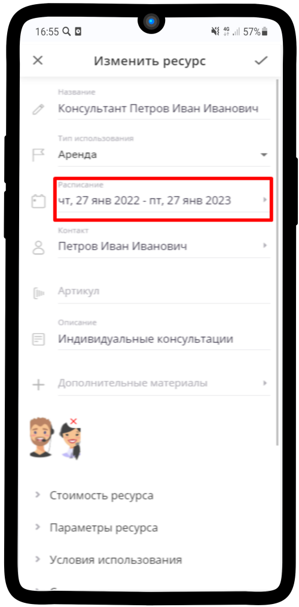

================================
Настройка расписания работы Консультанта
================================

.. note:: Подробную инcтрукцию по созданию расписания вы можете найти по ссылке: `Настройка расписания ресурса`_.

    .. _`Настройка расписания ресурса`: https://torrownet.readthedocs.io/ru/latest/resource/timetable-resource.html

1. Перейдите в ресурс Менеджера или Консультанта и нажмите на |точка| в правом верхнем углу

    .. |точка| image:: media/tochka.png
        :scale: 42 %

---------------------------

2. В выпадающем меню выберите **Изменить** 

---------------------------

3. Перейдите в поле **Расписание**.

------------------------

4. Пример **настройки расписания работы Консультанта и Менеджера** находится на изображении ниже. Сохраните результат, нажав на |галка|.

    .. |галка| image:: media/galka.png
        :scale: 42 %

---------------------------

5. Поле **Расписание** в меню настройки **Ресурса** заполнится.

------------------------

Также каждый менеджер может самостоятельно настроить свое расписание нажав на кнопку **Изменить график**

-----------------------------
