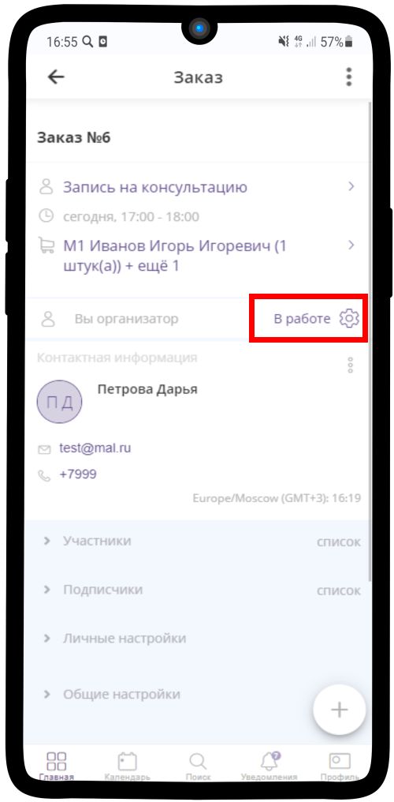
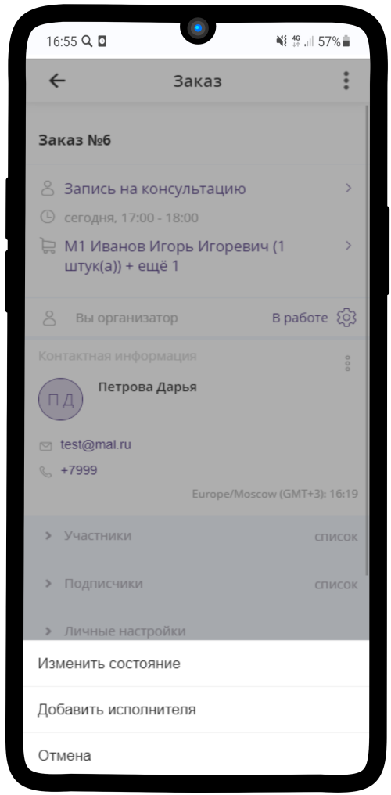
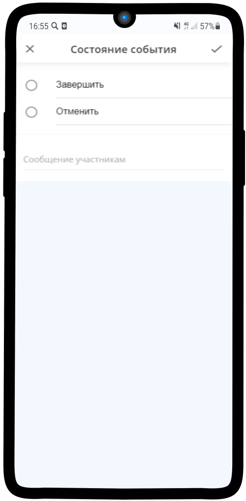
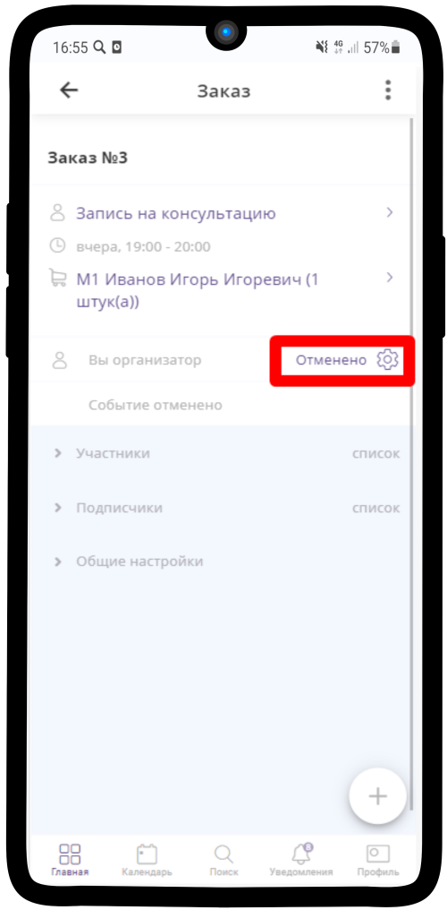

=====================================
Отмена Заявки (отмена проведения Консультации)
=====================================

1. Нажмите на **В работе** |шестеренка|

    .. |шестеренка| image:: media/nastroy.png
        :scale: 42 %

-------------------------------

2. В появившемся меню выберите **Изменить состояние**.

-------------------------------
3. Для отмены заказа выберите **Отменить**, укажите причину и нажмите |галка|.

    .. |галка| image:: media/galka.png
        :scale: 42 %

-------------------------------

4. **Готово!** Статус данного заказа изменен на **Отменено**.

-------------------------------