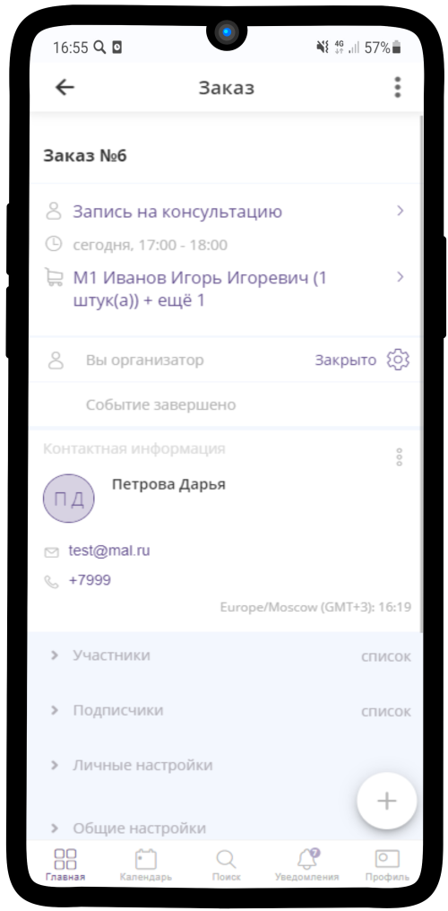
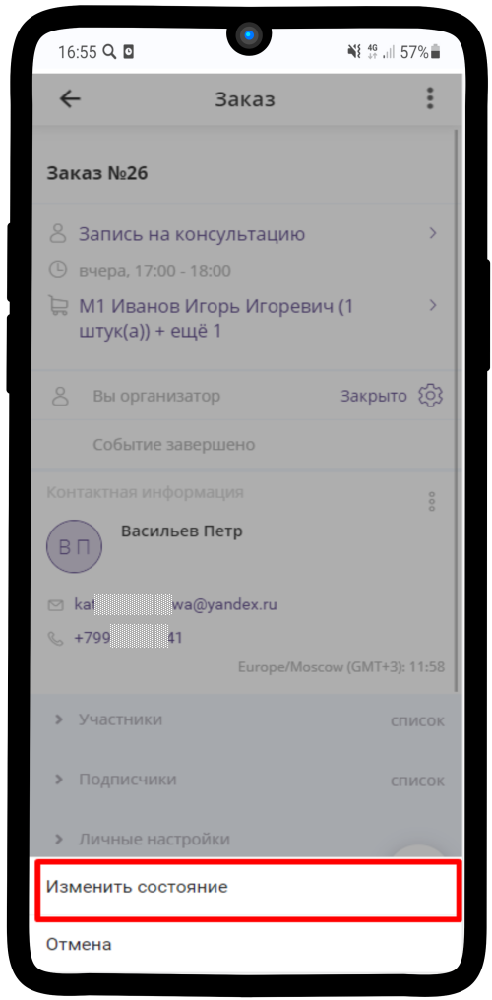
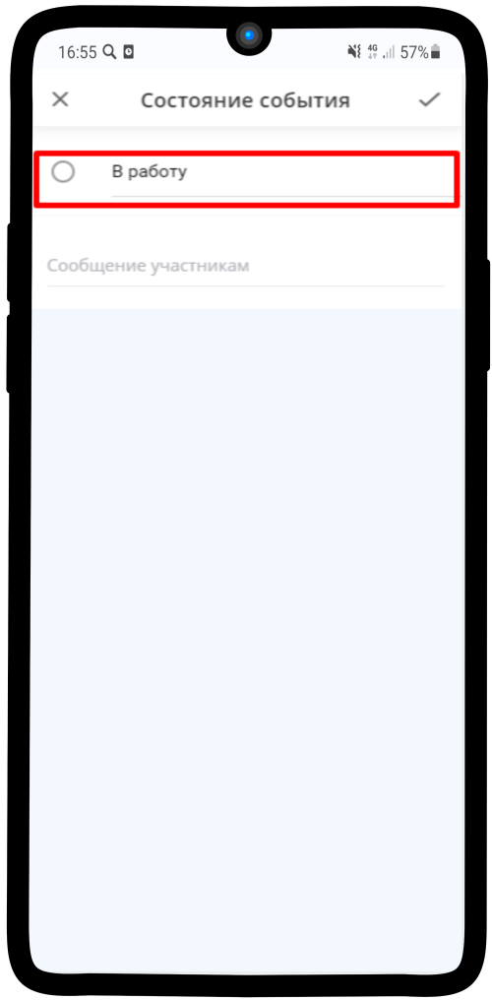
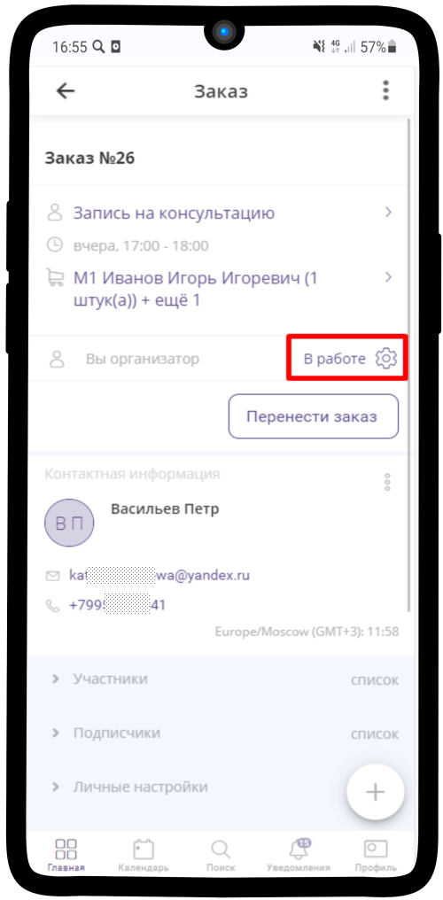

====================================================
Завершение выполнения Заявки (отмена завершения ИК)
====================================================

Завершение заявки
------------------

1. Нажмите на **В работе** |шестеренка|

    .. |шестеренка| image:: media/nastroy.png
        :scale: 42 %

.. figure:: media/take_mik13.png
    :scale: 42 %
    :alt: alternate text
    :align: center

-------------------------------

2. В появившемся меню выберите **Изменить состояние**.

.. figure:: media/take_mik3.png
    :scale: 42 %
    :alt: alternate text
    :align: center

-------------------------------

3. Выберите **Завершить** и нажмите |галка|.

    .. |галка| image:: media/galka.png
        :scale: 42 %

.. figure:: media/take_mik4.png
    :scale: 42 %
    :alt: alternate text
    :align: center

-------------------------------

4. **Готово!** Статус данного заказа изменен на **Закрыто**.

-------------------------------

Отмена завершения
------------------------

Если Вам необходимо по какой-то причине вернуть Заявку обратно в работу после того, как статус уже изменили на **Закрыто**, то необходимо сделать:

1. Открыть нужную Заявку, нажать на **Закрыто** |шестеренка| и выбрать **Изменить состояние**

-------------------------------

2. Нажмите **В работу**

-------------------------------

3. Заказ вернулся обратно в работу

-------------------------------