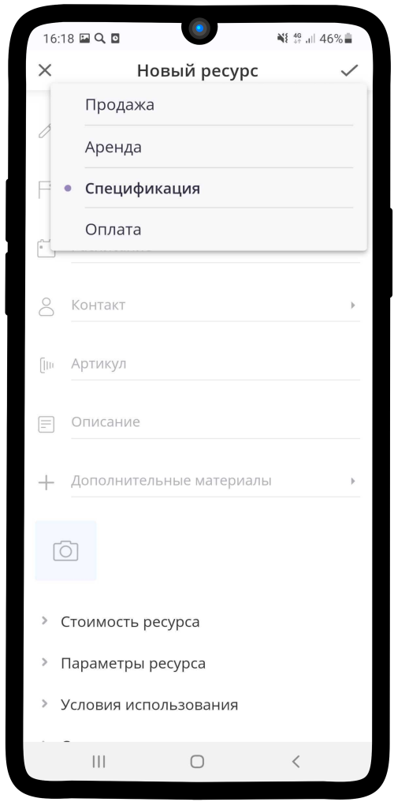
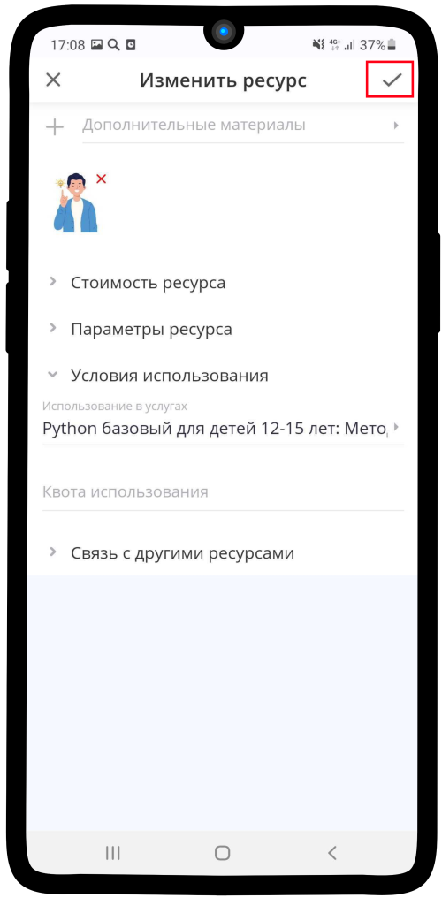
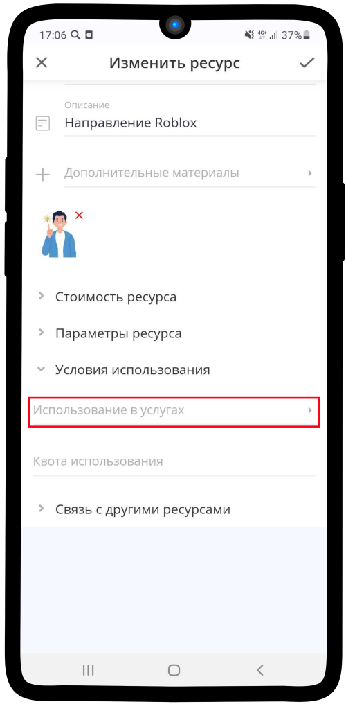

Настройка нового Методиста индивидуального мастер класса (МИМК)
---------------------------------------------------------------

Чтобы настроить ресурс **Методиста индвидиуального мастер-класса**:

1. Зайдите в **элемент**, который является хранилищем всех ресурсов типа **М1**. Нажмите на кнопку |плюс|.

    .. |плюс| image:: _static/plus.png
        :scale: 42 %

.. figure:: _static/mimk/mimk1.png
    :scale: 42 %
    :alt: alternate text
    :align: center

2. Выберите в списке |массив|.

    .. |массив| image:: _static/reserved.png
        :scale: 42 %

.. figure:: _static/mimk/mimk2.png
    :scale: 42 %
    :alt: alternate text
    :align: center

3. Нажмите на кнопку **Создать ресурс**.

.. figure:: _static/mimk/mimk3.png
    :scale: 42 %
    :alt: alternate text
    :align: center

4. Нажмите на поле **Тип использования**.

5. В открышемся списке выберите **Аренда**. Затем заполните поле **Название**.

.. figure:: _static/mimk/mimk6.png
    :scale: 42 %
    :alt: alternate text
    :align: center

6. Нажмите на поле **Контакт**.

.. figure:: _static/mimk/mimk7.png
    :scale: 42 %
    :alt: alternate text
    :align: center

7. В строке поиске введите нужный контакт, который и будет являтся **методистом индивидуальных мастер-классов**. Затем нажмите на кнопку |галка|.

    .. |галка| image:: _static/galka.png
        :scale: 42 %

.. figure:: _static/mimk/mimk8.png
    :scale: 42 %
    :alt: alternate text
    :align: center

8. Нажмите на поле **Расписание**. Заполните его, используя инструкцию :ref:`admin4-label`.

.. figure:: _static/mimk/mimk9.png
    :scale: 42 %
    :alt: alternate text
    :align: center

9. Загрузите необходимое **изображение** для ресурса.

.. figure:: _static/mimk/mimk10.png
    :scale: 42 %
    :alt: alternate text
    :align: center

10. Нажмите на поле **Параметры ресурса**.

.. figure:: _static/mimk/mimk11.png
    :scale: 42 %
    :alt: alternate text
    :align: center

11. Введите **значения**, как на изображении ниже.

.. figure:: _static/mimk/mimk12.png
    :scale: 42 %
    :alt: alternate text
    :align: center

12. Нажмите на поле **Условия использования**. Выберите **Использование услуги**.

.. figure:: _static/mimk/mimk13.png
    :scale: 42 %
    :alt: alternate text
    :align: center

13.  Нажмите на текст **Добавить услугу для ресурса**

.. figure:: _static/mimk/mimk14.png
    :scale: 42 %
    :alt: alternate text
    :align: center

15. Нажмите на поле **Услуга**.

.. figure:: _static/mimk/mimk15.png
    :scale: 42 %
    :alt: alternate text
    :align: center

16. Введите в **поисковую строку** название необходимой услуги, затем выберите её и нажмите на |галка|.

.. figure:: _static/mimk/mimk16.png
    :scale: 42 %
    :alt: alternate text
    :align: center

17. Нажмите на поле **Шаг записи на услугу**.

.. figure:: _static/mimk/mimk17.png
    :scale: 42 %
    :alt: alternate text
    :align: center

18. Выберите **Методист ИМК** и нажмите |галка|.

.. figure:: _static/mimk/mimk18.png
    :scale: 42 %
    :alt: alternate text
    :align: center

19. Сохраните **ресурс**. Для этого нажмите на |галка|.

20. Ваш ресурс **готов**!

