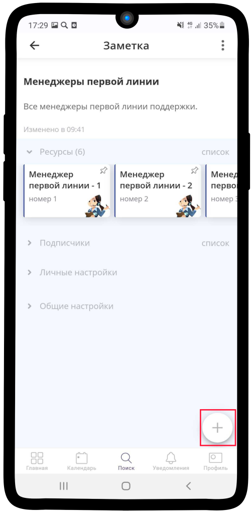
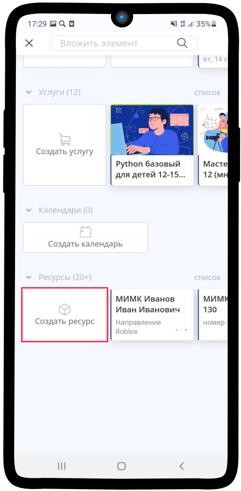
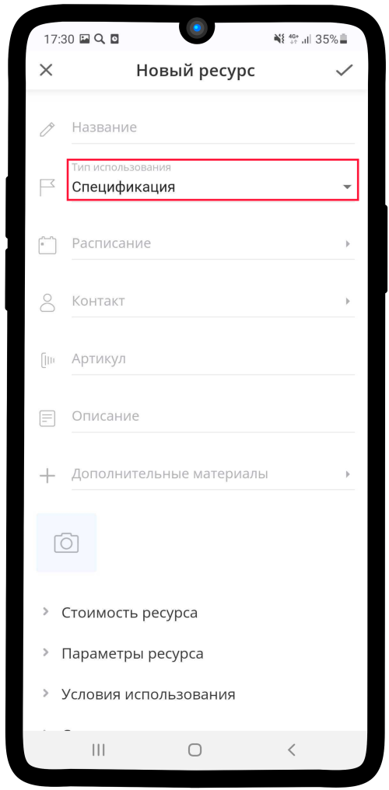
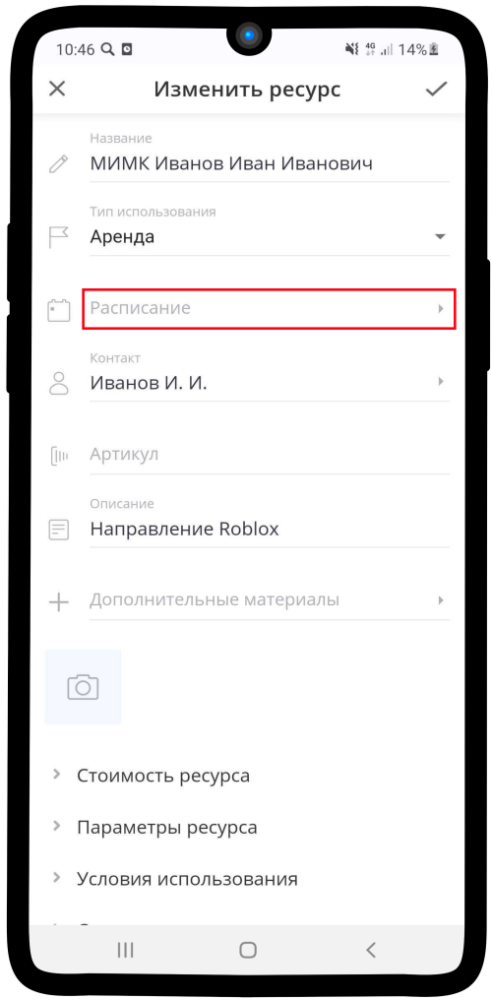
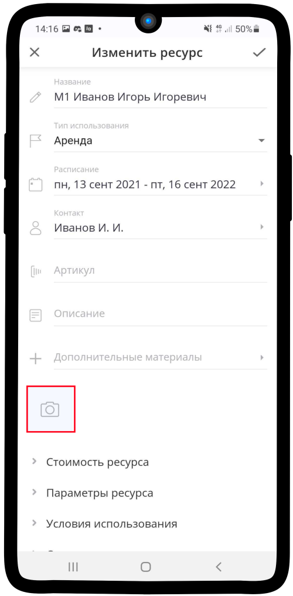
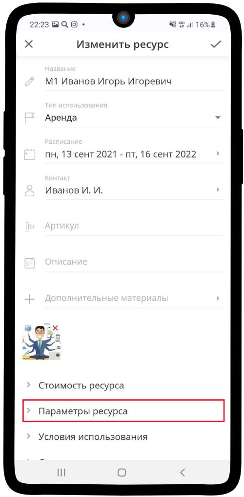
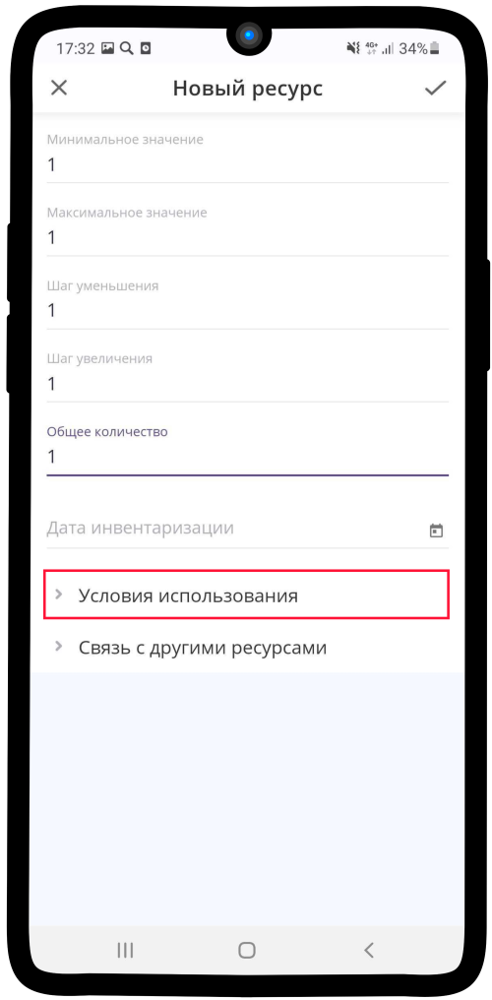
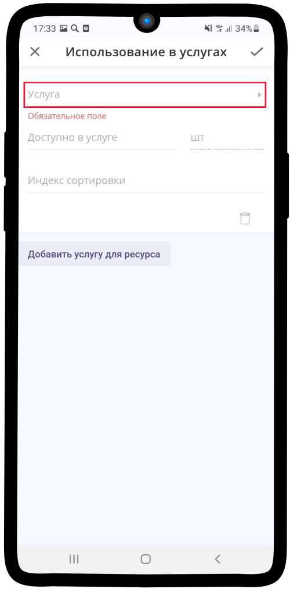

============================================
Настройка нового Менеджера первой линии (М1)
============================================

Чтобы настроить нового **Менеджера первой линии поддержки**, необходимо создать в приложении Torrow ресурс типа **Аренда**.

.. note:: Подробную инcтрукцию по созданию ресурса вы можете найти по ссылке: `Создание ресурса с типом Аренда`_.

    .. _`Создание ресурса с типом Аренда`: https://torrownet.readthedocs.io/ru/latest/resource/rent-resource.html

Создание ресурса **Менеджер первой линии поддержки**:

1. Зайдите в **элемент**, который является хранилищем всех ресурсов типа **М1**.

.. figure:: media/manager1/M1.png
    :scale: 42 %
    :alt: alternate text
    :align: center

2. Воспользуйтесь инструкцией по ссылке: `Создание ресурса с типом Аренда`_.

    .. _`Создание ресурса с типом Аренда`: https://torrownet.readthedocs.io/ru/latest/resource/rent-resource.html

.. figure:: media/imk3.png
    :scale: 42 %
    :alt: alternate text
    :align: center

3. Заполните параметры ресурса по **данным таблицы ниже**.

.. list-table:: Параметры услуги для проведения мастер-классов
   :widths: 20 15 45
   :header-rows: 1

   * - Наименование параметра
     - Значение
     - Описание
   * - Название ресурса
     - М1 ФИО
     - Введите необходимое название
   * - Тип использования
     - Аренда
     - Не использовать другие типы ресурса
   * - Расписание
     - Да
     - Воспользуйтесь инструкцией: :ref:`admin4-label`
   * - Контакт
     - Указать визитку реального менеджера
     - Необходимо для отображения заказов в личном календаре  
   * - Артикул
     - Можно не заполнять
     - Необходим для идентификации ресурса
   * - Описание
     - Можно не заполнять
     - Данный параметр не обязателен для использования ресурса
   * - Дополнительные матиралы
     - Оставить поле пустым
     - Данный параметр не обязателен для использования ресурса
   * - **Стоимость ресурса**
     - 
     - 
   * - Цена
     - Оставить поле пустым
     - Данный параметр не обязателен для использования ресурса
   * - **Парметры ресурса**
     - 
     - 
   * - Длительность
     - Оставить поле пустым
     - Данный параметр не обязателен для использования ресурса
   * - Ед. измерения
     - Шт
     - Необходимая единица измерения
   * - Округлить до
     - Целых
     - Параметр необходим для работы ресурса
   * - Начальное значение
     - 1
     - Параметр необходим для работы ресурса
   * - Минимальное значение
     - 1
     - Минимальное количество данного ресурса в услуге при выполнении заказа
   * - Максимальное количество
     - 1
     - Максимальное количество данного ресурса в услуге при выполнении заказа
   * - Шаг уменьшения
     - 1
     - Значение на которое уменьшается количество выбранного ресурса при нажатии на **-** в заказе
   * - Шаг увеличения
     - 1
     - Значение на которое увеличивается количество выбранного ресурса при нажатии на **+** в заказе
   * - Общее количество
     - 1
     - Общее количество ресурсов
   * - **Условия использования**
     - 
     - 
   * - Использование в услугах
     - Выбрать необходимую услугу
     - Описание процесса привязки ресурса к услуге: https://torrownet.readthedocs.io/ru/latest/resource/conditions-resource.html
   * - Квота использования
     - Оставить поле пустым
     - Данный параметр не нужен для использования ресурса
   * - **Связь с другими ресурсами**
     - 
     - 
   * - Тип связи
     - Нет
     - Ресурсы не должны быть связаны друг с другом
   * - Список ресурсов
     - Оставить поле пустым
     - Данный параметр не нужен для использования ресурса

-----------------------------

Подробная инструкция по настройке менеджера первой линии
--------------------------------------------------------

Чтобы настроить ресурс **Менеджера первой линии**:

1. Зайдите в **элемент**, который является хранилищем всех ресурсов типа **М1**.

.. figure:: media/manager1/M1.png
    :scale: 42 %
    :alt: alternate text
    :align: center

2. Нажмите на кнопку |плюс|.

    .. |плюс| image:: media/plus.png
        :scale: 42 %

3. Выберите в списке |массив|.

    .. |массив| image:: media/reserved.png
        :scale: 42 %

.. figure:: media/manager1/M3.png
    :scale: 42 %
    :alt: alternate text
    :align: center

4. Нажмите на кнопку **Создать ресурс**.

5. Нажмите на поле **Тип использования**.

6. В открышемся списке выберите **Аренда**. Затем заполните поле **Название**.

.. figure:: media/manager1/M6.png
    :scale: 42 %
    :alt: alternate text
    :align: center

7. Нажмите на поле **Контакт**.

.. figure:: media/manager1/M0.png
    :scale: 42 %
    :alt: alternate text
    :align: center

8. В строке поиске введите нужный контакт, который и будет являтся **менджером первой линии**. Затем нажмите на кнопку |галка|.

    .. |галка| image:: media/galka.png
        :scale: 42 %

.. figure:: media/manager1/M0.1.png
    :scale: 42 %
    :alt: alternate text
    :align: center

9. Нажмите на поле **Расписание**. Заполните его, используя инструкцию :ref:`admin4-label`.

10. Загрузите необходимое **изображение** для ресурса.

11. Нажмите на поле **Параметры ресурса**.

12. Введите **значения**, как на изображении ниже.

.. figure:: media/manager1/M9.png
    :scale: 42 %
    :alt: alternate text
    :align: center

13. Нажмите на поле **Условия использования**.

14. Выберите **Использование услуги**.

.. figure:: media/manager1/M11.png
    :scale: 42 %
    :alt: alternate text
    :align: center

15. Нажмите на текст **Добавить услугу для ресурса**

.. figure:: media/manager1/M12.png
    :scale: 42 %
    :alt: alternate text
    :align: center

16. Нажмите на поле **Услуга**.

17. Введите в **поисковую строку** название необходимой услуги, затем выберите её и нажмите на |галка|.

.. figure:: media/manager1/M14.png
    :scale: 42 %
    :alt: alternate text
    :align: center

18. Нажмите на поле **Шаг записи на услугу**.

.. figure:: media/manager1/M15.png
    :scale: 42 %
    :alt: alternate text
    :align: center

19. Выберите **Менеджер первой линии** и нажмите |галка|.

.. figure:: media/manager1/M16.png
    :scale: 42 %
    :alt: alternate text
    :align: center

20. Сохраните **ресурс**. Для этого нажмите на |галка|.

.. figure:: media/manager1/M17.png
    :scale: 42 %
    :alt: alternate text
    :align: center

21. Ваш ресурс **готов**!

