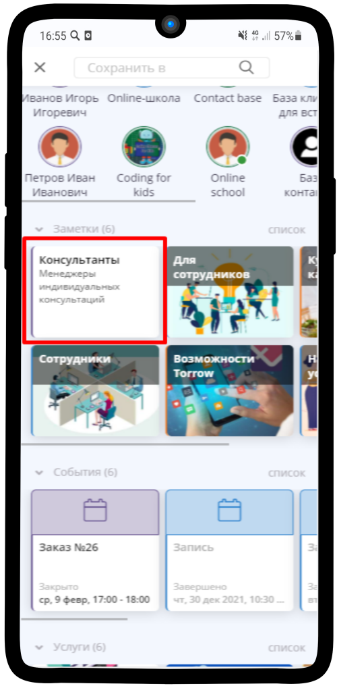

.. _admin6-label:

=========================
Настройка прав доступа
=========================

.. hint:: Сотрудникам нужно передать определенные права, чтобы они могли редактировать элементы, принимать заказы. Также Сотрудники должны передать права доступа Администратору, чтобы он мог назначать их Исполнителями и редактировать их элементы.

1. После того, как Менеджер сохранит необходимые для работы элементы, Вам необходимо сохранить его визитку на страницу Онлайн-школы. Перейдите во вкладку **Уведомления**. Нажмите на имя пользователя, который сохранил элемент

.. figure:: media/rights/admin1.png
    :scale: 42 %
    :alt: alternate text
    :align: center

-------------

2. Нажмите на |точка| в правом верхнем углу

    .. |точка| image:: media/tochka.png
        :scale: 42 %

.. figure:: media/rights/admin2.png
    :scale: 42 %
    :alt: alternate text
    :align: center

-------------

3. Выберите **Сохранить в**

-------------

4. Выберите заметку с подходящей группой менеджеров

-------------

5. Нажмите **Сохранить**

.. figure:: media/rights/consult16.png
    :scale: 42 %
    :alt: alternate text
    :align: center

-------------

6. Нажмите на |галка|

    .. |галка| image:: media/galka.png
        :scale: 42 %

-------------

7. Перейдите в ресурс Менеджера, откройте **Подписчиков**

.. figure:: media/rights/consult17.png
    :scale: 42 %
    :alt: alternate text
    :align: center

-------------

8. Нажмите на |точка| рядом с именем Менеджера

.. figure:: media/rights/admin8.png
    :scale: 42 %
    :alt: alternate text
    :align: center

-------------

9. Выберите **Сделать менеджером**

.. figure:: media/rights/admin9.png
    :scale: 42 %
    :alt: alternate text
    :align: center

-------------

Ссылка на элемент
------------------

.. note:: При необходимости Вы можете поделиться любым элементомс другими пользователями

1. Чтобы поделиться ссылкой на страницу Онлайн-школы, нажмите на |точка| в правом верхнем углу

-------------

2. Выберите пункт **Поделиться**

.. figure:: media/rights/mpz12.png
    :scale: 42 %
    :alt: alternate text
    :align: center

-------------

3. Нажмите на **Поделиться** в правом нижнем углу

-------------

4. Выберите подходящий формат - **Ссылка**

.. figure:: media/rights/mpz13.png
    :scale: 42 %
    :alt: alternate text
    :align: center

-------------

5. Ссылка скопирована в буфер обмена, можете вставлять ее любым удобным Вам способом

.. figure:: media/rights/mpz14.png
    :scale: 42 %
    :alt: alternate text
    :align: center

-------------