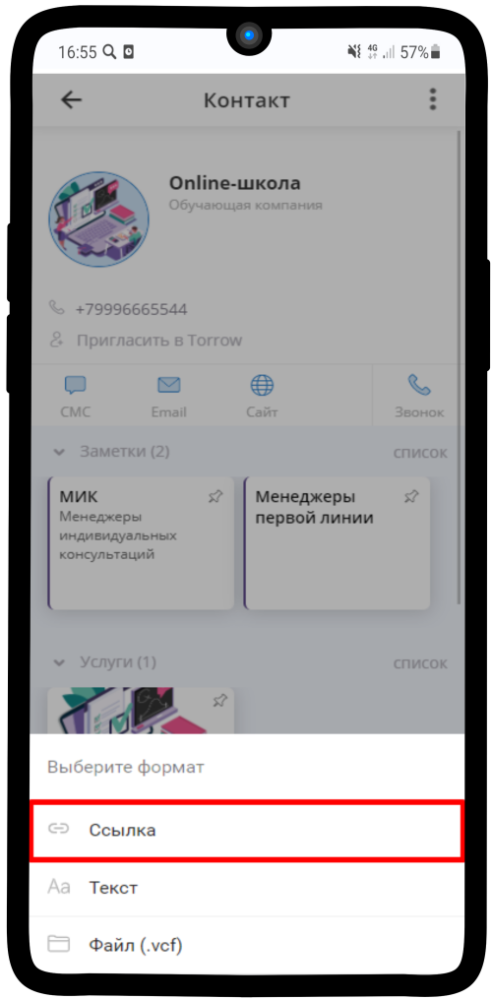
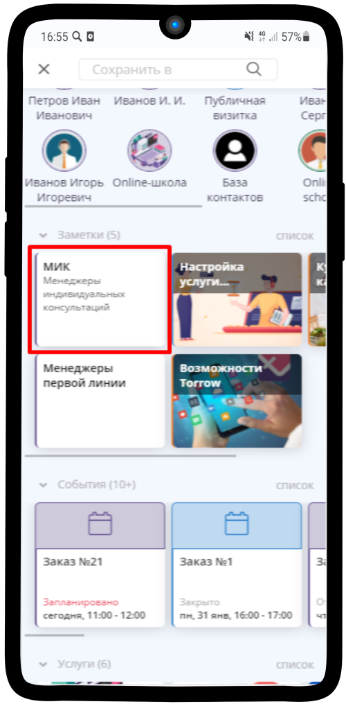

.. _admin6-label:

=========================
Настройка прав доступа
=========================

1. Чтобы поделиться ссылкой на страницу Онлайн-школы, нажмите на |точка| в правом верхнем углу

-------------

2. Выберите пункт **Поделиться**

-------------

3. Нажмите на **Поделиться** в правом нижнем углу

.. figure:: media/rights/link3.png
    :scale: 42 %
    :alt: alternate text
    :align: center

-------------

4. Выберите подходящий формат - **Ссылка**

-------------

5. Ссылка скопирована в буфер обмена, можете вставлять ее любым удобным Вам способом

-------------

Чтобы Вы могли редактировать расписание и назначать исполнителей, нужно получить права доступа, а также передать права доступа Менеджерам.

1. После того, как Менеджер сохранит необходимые для работы элементы, Вам необходимо сохранить его визитку на страницу Онлайн-школы. Перейдите во вкладку **Уведомления**. Нажмите на имя пользователя, который сохранил элемент

.. figure:: media/rights/admin1.png
    :scale: 42 %
    :alt: alternate text
    :align: center

-------------

2. Нажмите на |точка| в правом верхнем углу

    .. |точка| image:: media/tochka.png
        :scale: 42 %

-------------

3. Выберите **Сохранить в**

.. figure:: media/rights/admin3.png
    :scale: 42 %
    :alt: alternate text
    :align: center

-------------

4. Выберите заметку с подходящей группой менеджеров

-------------

5. Нажмите **Сохранить**

-------------

6. Нажмите на |галка|

    .. |галка| image:: media/galka.png
        :scale: 42 %

.. figure:: media/rights/admin6.png
    :scale: 42 %
    :alt: alternate text
    :align: center

-------------

7. Перейдите в ресурс Менеджера, откройте **Подписчиков**

-------------

8. Нажмите на |точка| рядом с именем Менеджера

.. figure:: media/rights/admin8.png
    :scale: 42 %
    :alt: alternate text
    :align: center

-------------

9. Выберите **Сделать менеджером**

.. figure:: media/rights/admin9.png
    :scale: 42 %
    :alt: alternate text
    :align: center

-------------