======================
Настройка Базы клиентов
======================

Создание Базы клиентов
------------------------

1. Для удобства пользования и компактного хранения создадим заметку **Для сотрудников**. В правом нижнем углу нажмите на |плюс|

    .. |плюс| image:: media/plus.png
        :scale: 42 %

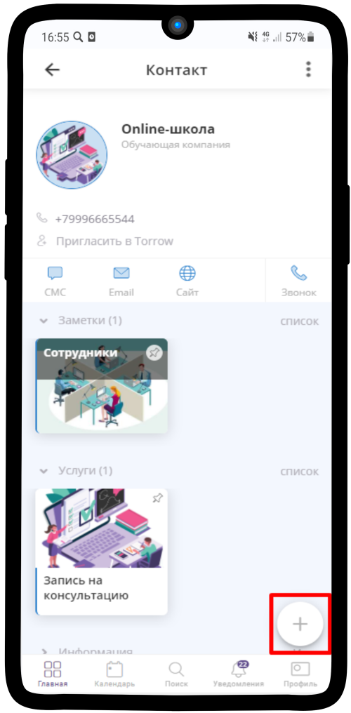

-------------

2. Выберите заметку

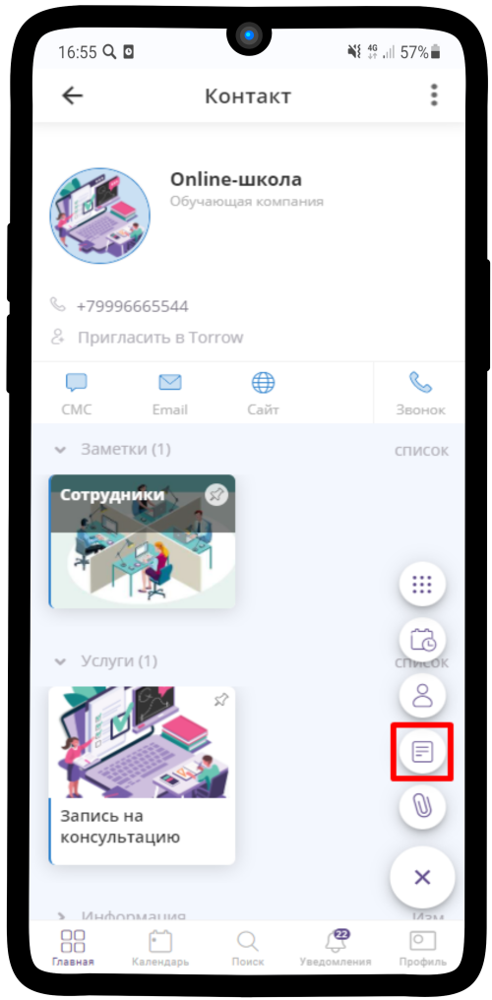

-------------

3. Открылось окно Новой заметки.

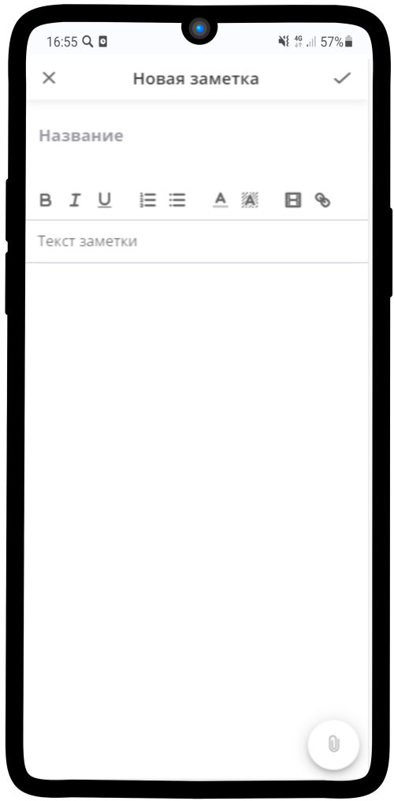

-------------

4. Впишите название, например, Для сотрудников. Загрузите обложку, нажав на значок скрепки в правом нижнем углу.

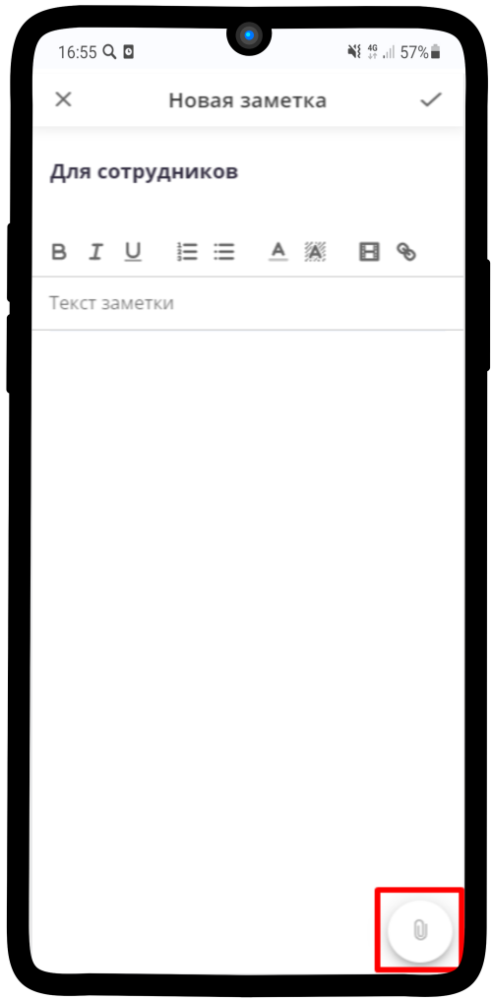

-------------

5. Установите размер изображения, нажав на **настройки** рядом с картинкой.

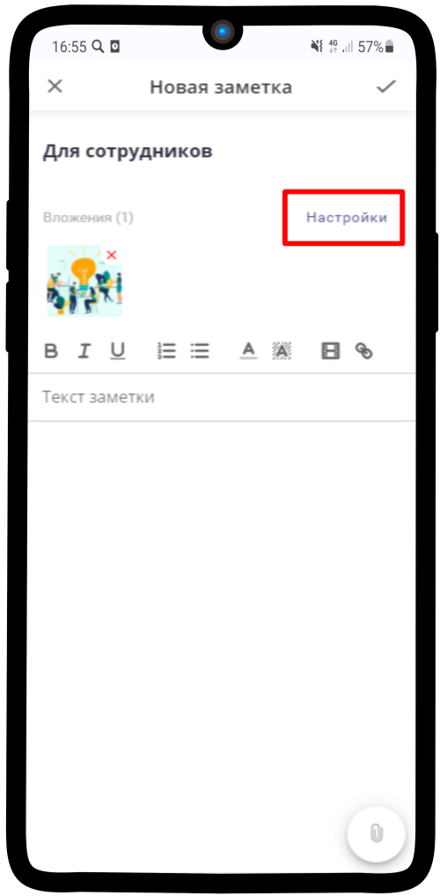

-------------

6. Рекомендуем выбрать **Большой слайдер**

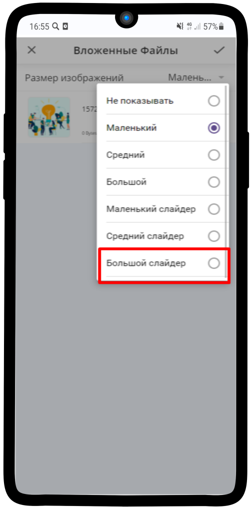

-------------

7. Вставьте необходимые ссылки на руководство и нажмите на |галка|, чтобы сохранить

    .. |галка| image:: media/galka.png
        :scale: 42 %

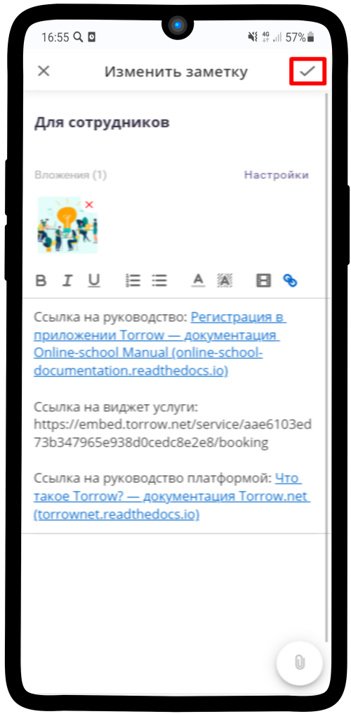

-------------

8. Теперь добавим сюда Базу клиентов, чтобы было удобнее проверять данные о клиентах и заказах. Нажмите на |плюс| в правом нижнем углу

-------------

9. Далее нажмите на |меню|

    .. |меню| image:: media/reserved.png
        :scale: 42 %

-------------

10. Выберите в списке контактов нужный

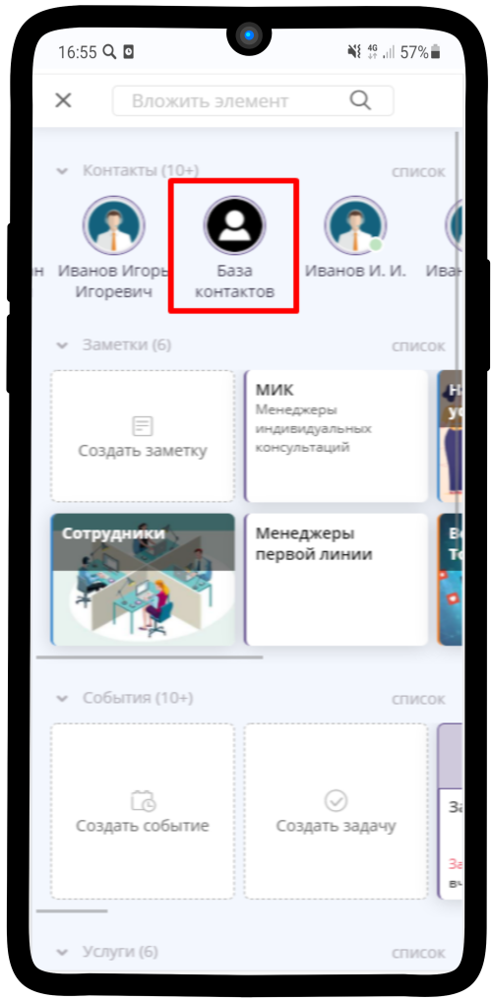

-------------

11. Нажмите **Вложить**

-------------

12. База контактов теперь есть в заметке **Для сотрудников**

-------------

13. Чтобы Базу было видно менеджерам, нужно ее прикрепить: долгим нажатием выделите элемент - появится меню. Выберите **Прикрепление к элементам**.

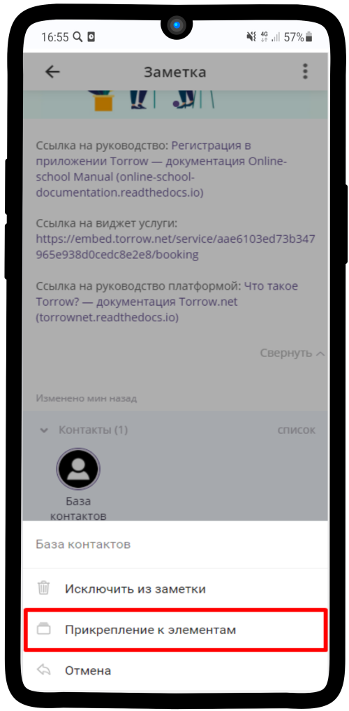

-------------

14. В открывшемся окошке нажмите на |переключатель|

       .. |переключатель| image:: media/prin.png
        :scale: 42 %

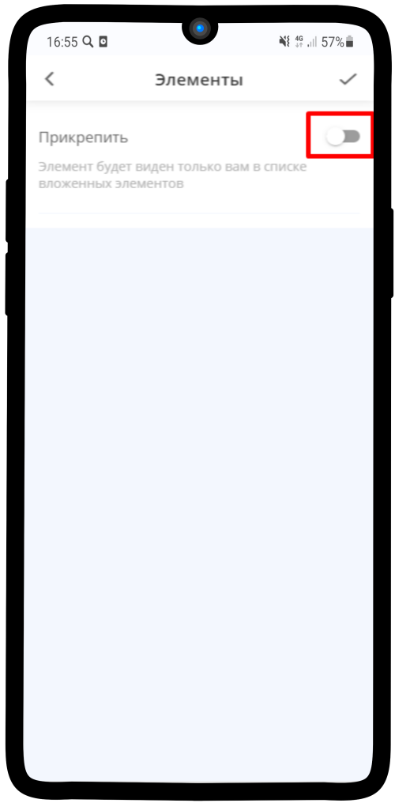

-------------

15. Отметьте пункт **Включить в группы** - **Заметка "Для сотрудников"** и нажмите |галка|

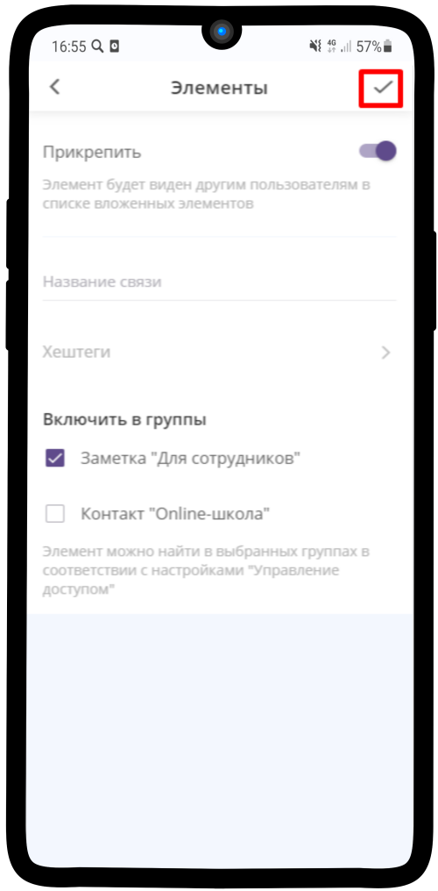

-------------

16. Рядом с Базой контактов пропал значок прикрепления |глаз| - она видна менеджерам

       .. |глаз| image:: media/invisible.png
        :scale: 42 %

17. Теперь нужно включить поиск по Базе клиентов. Для этого перейдем в **Общие настройки**

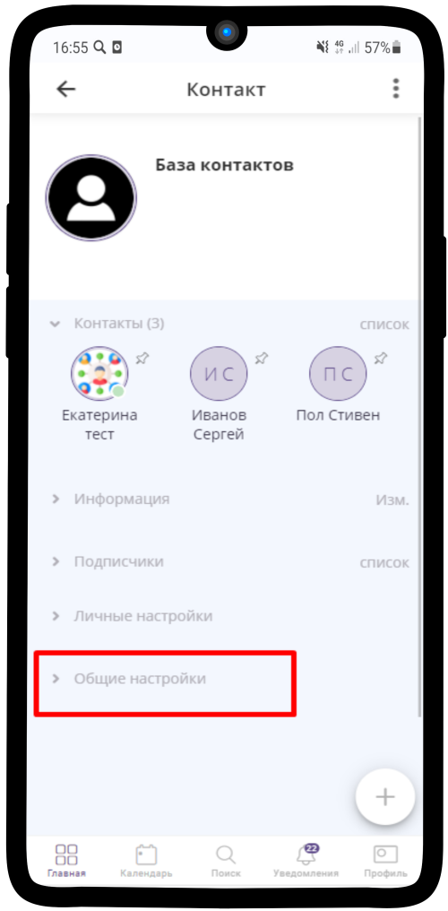

-------------

18. Далее пункт **Управление доступом**

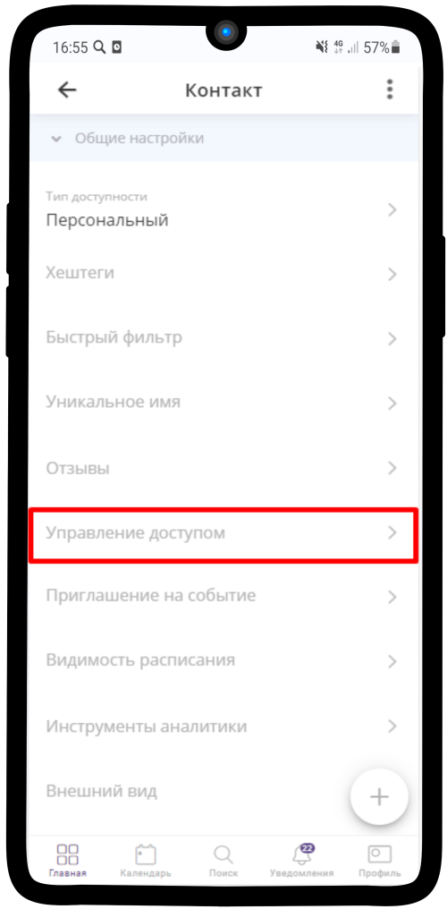

-------------

19. В поле **Могут искать прикрепленные элементы** отмечаем **владельцы и менеджеры**

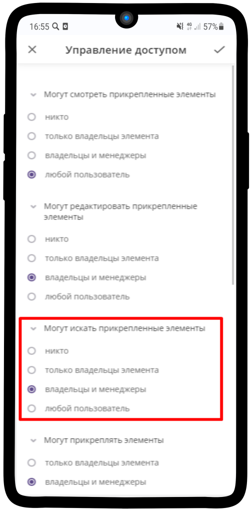

-------------

20. Настройка готова!

.. figure:: media/base/base20.png
    :scale: 42 %
    :alt: alternate text
    :align: center

-------------

Работа с Базой клиентов
-----------------------------

1.  При создании заказа и возникновении вопроса с ним операторы могут проверить его наличие с помощью Базы контактов. Она расположена в заметке "Для сотрудников"

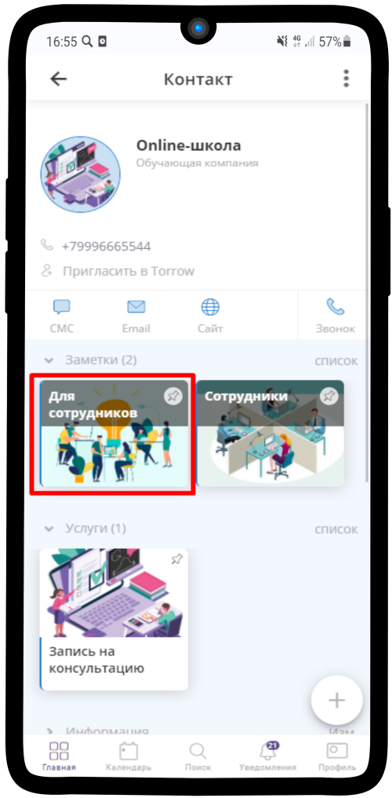

-------------

2. Войдите в Базу контактов

-------------

3. Внутри можете увидеть строку поиска, где необходимо ввести телефон или имя клиента

.. figure:: media/base/base20.png
    :scale: 42 %
    :alt: alternate text
    :align: center

-------------

4. Далее открываем нужный контакт и нажимаем на **Расписание**

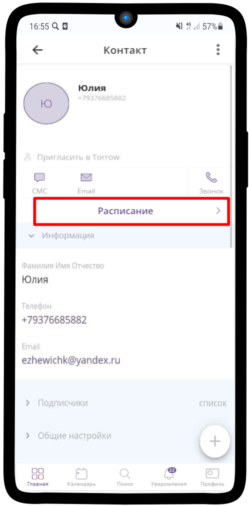

-------------

5. Проверяем наличие спорной заявки

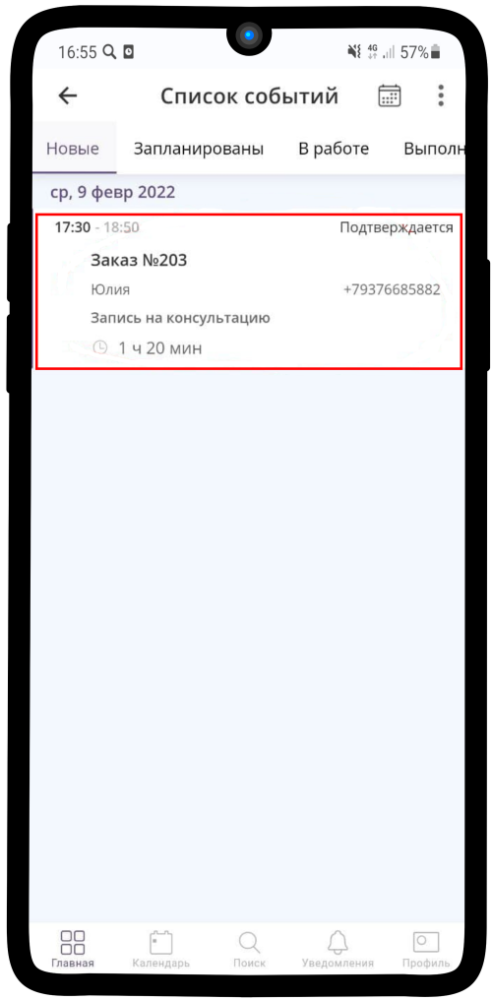

-------------
