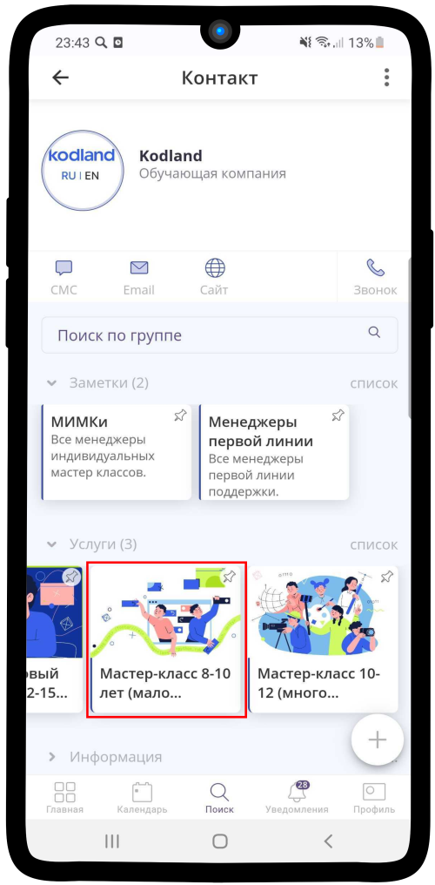
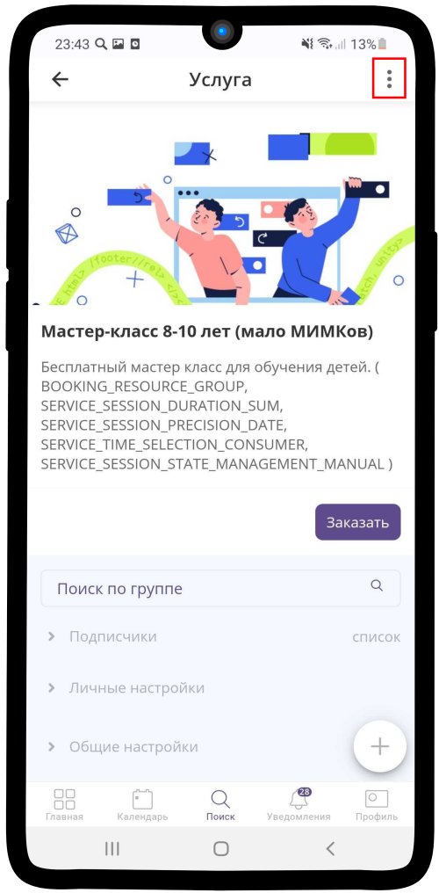
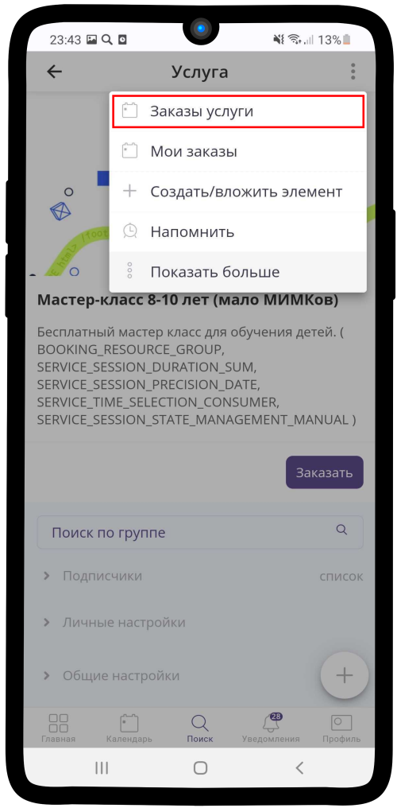
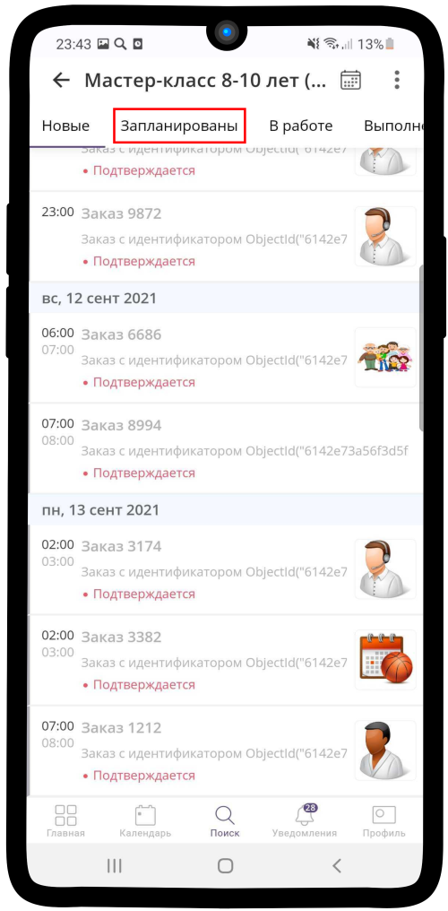
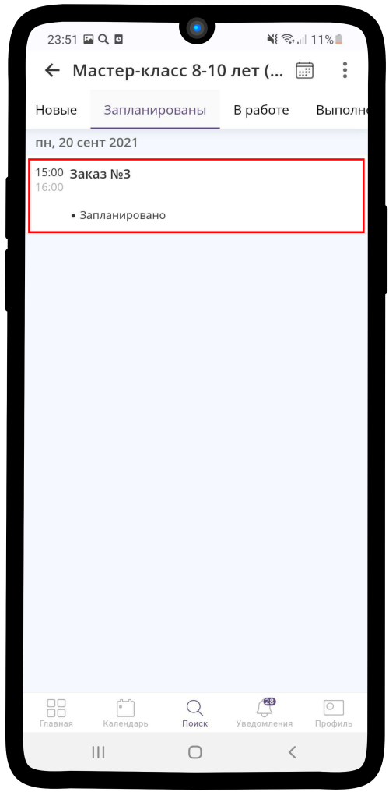
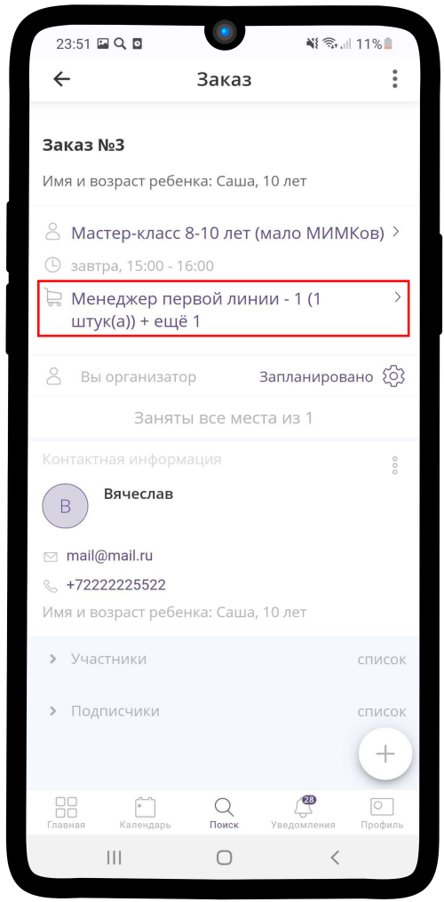
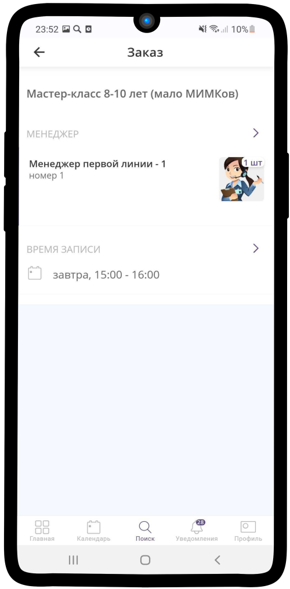

=================================
Просмотр Заявок возрастной группы
=================================

.. note:: Раздел находится в разработке.

Чтобы посмотреть все текущие **заявки** какой-либо **возрастной группы**:

1. Зайдите в необходимую **услугу**.

2. Нажмите на кнопку |точка|.

    .. |точка| image:: media/tochka.png
        :scale: 42 %

3. В появившемся меню выберите **Заказы услуги**.

3. Перед Вами список заказов, которые разделены на категории по **статусам выполнения**. Перейдите в одну из вкладок.

4. Нажмите на имеющийся **Заказ**.

5. Нажмите на детали заказа |корзина|.

    .. |корзина| image:: media/shopping-cart.png
        :scale: 42 %

6. Перед Вами откроется **детальная информация** о заказе. Как можете наблюдать в данном заказе еще не назначен методист индивидуальных мастер-классов.

