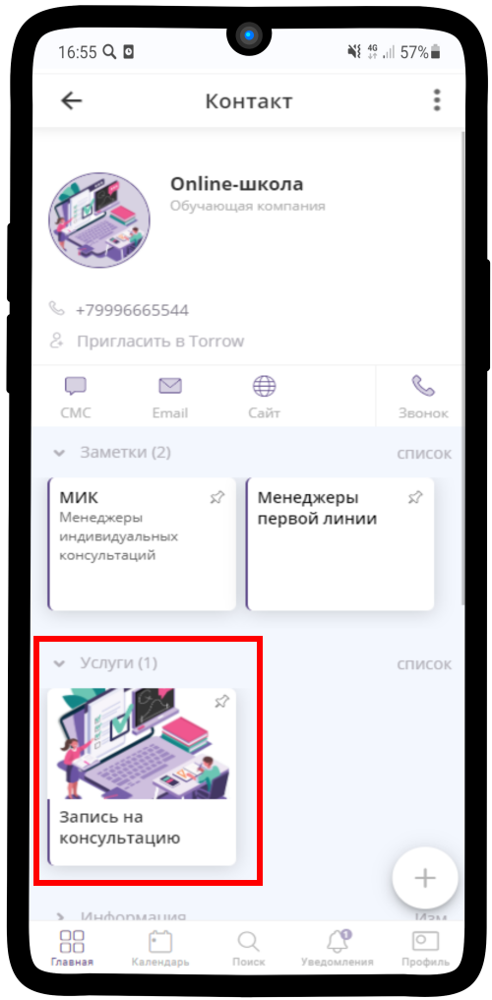

=================================
Просмотр Заявок на консультацию
=================================

Чтобы посмотреть все текущие **заявки на консультацию**:

1. Зайдите в необходимую **услугу**.

-----------------------

2. Нажмите на кнопку |точка|.

    .. |точка| image:: media/tochka.png
        :scale: 42 %

-----------------------

3. В появившемся меню выберите **Заказы услуги**.

.. figure:: media/watch_application/orders1.png
    :scale: 42 %
    :alt: alternate text
    :align: center

-----------------------

4. Перед Вами список заказов, которые разделены на категории по **статусам выполнения**. Перейдите в одну из вкладок.

.. figure:: media/watch_application/orders2.png
    :scale: 42 %
    :alt: alternate text
    :align: center

-----------------------

5. Нажмите на имеющийся **Заказ** и на детали заказа |корзина|.

    .. |корзина| image:: media/shopping-cart.png
        :scale: 42 %

-----------------------

6. Перед Вами откроется **детальная информация** о заказе. Как можете наблюдать в данном заказе еще не назначен методист индивидуальных мастер-классов.

.. figure:: media/watch_application/orders4.png
    :scale: 42 %
    :alt: alternate text
    :align: center

-----------------------