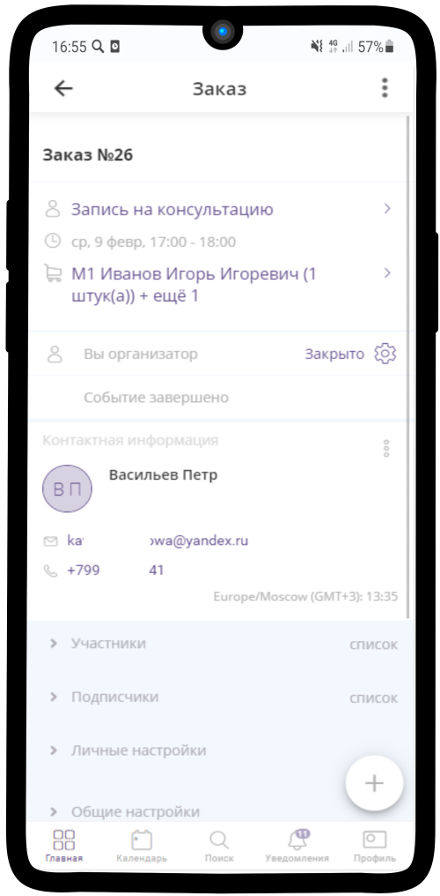
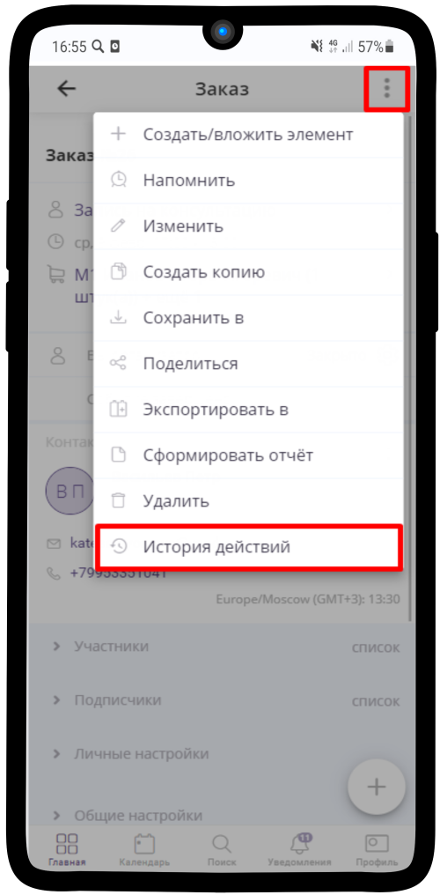
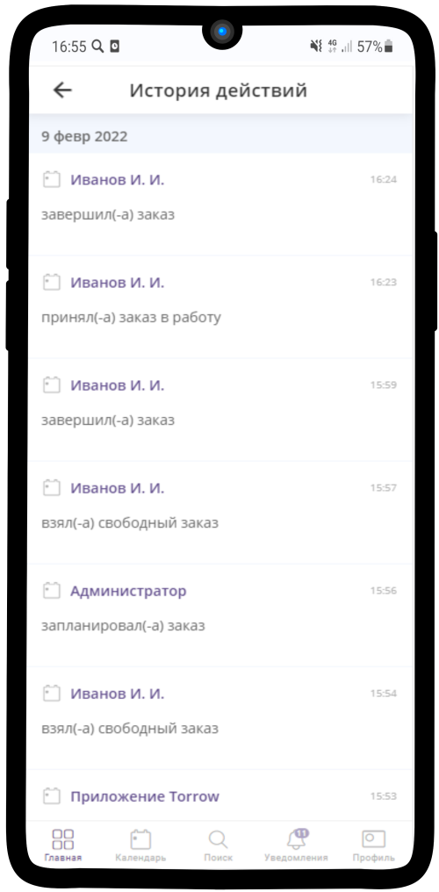

==================================
Просмотр истории исполнения Заявки
==================================

.. note:: Из истории действий над заказом можно узнать информацию о всех операциях совершенных над заказом с учетом времени изменений и исполнителей.

1. Чтобы посмотреть историю действий над заказом, перейдите в нужный заказ.

------------------------------------

2. Нажмите на |точка| в правом верхнем углу и из выпадающего меню выберите "История действий".

   .. |точка| image:: media/tochka.png
    :scale: 42 %

------------------------------------

3. В истории действий можно посмотреть все операции над заказом, а также кто их производил.

------------------------------------