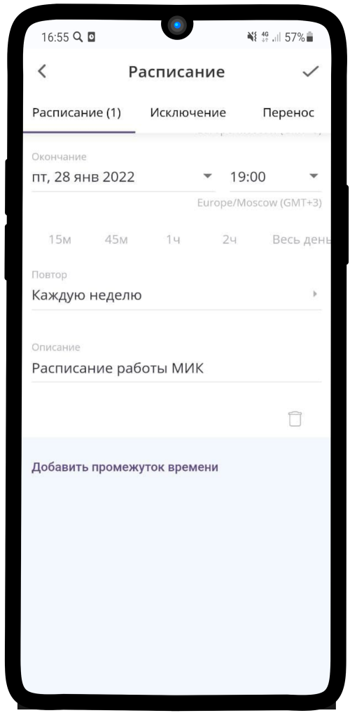
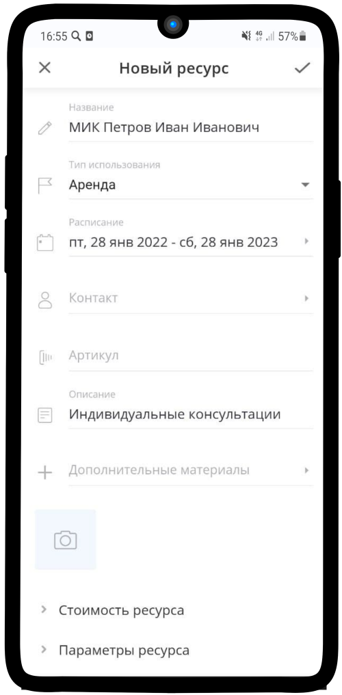

================================
Настройка расписания работы МИК
================================

.. note:: Подробную инcтрукцию по созданию расписания вы можете найти по ссылке: `Настройка расписания ресурса`_.

    .. _`Настройка расписания ресурса`: https://torrownet.readthedocs.io/ru/latest/resource/timetable-resource.html

1. Пример **настройки расписания работы Менеджера индивидуальных консультаций и Менеджера (приём заявок)** находится на изображении ниже. Сохраните результат, нажав на |галка|.

    .. |галка| image:: media/galka.png
        :scale: 42 %

----------------------------------

2. Поле **Расписание** в меню настройки **Ресурса** заполнится.

