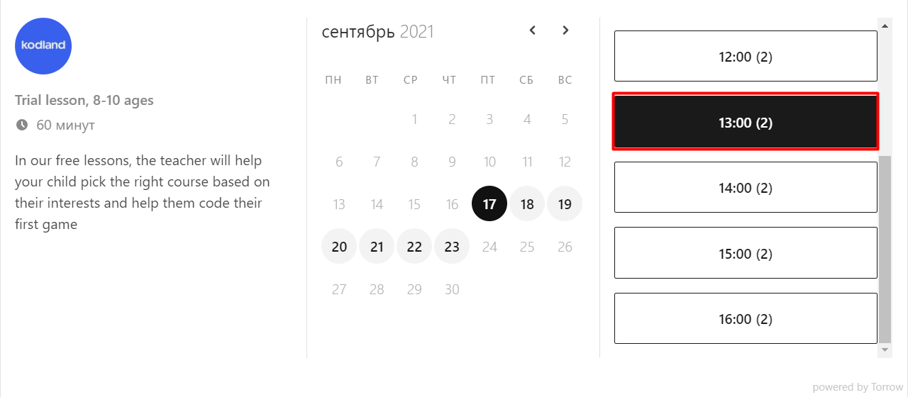

Подача заявки на Индивидуальный мастер класс
--------------------------------------------

1. Перейдите на сайт KODLAND_ и зарегистрируйтесь на урок по форме ниже.
    .. _KODLAND: https://www.kodland.org/

.. figure:: _static/record/rec0.png
    :scale: 42 %
    :alt: alternate text
    :align: center

2. Выберите подходящую **дату** для проведения **индивидуального мастер-класса**.

.. figure:: _static/record/rec1.png
    :scale: 42 %
    :alt: alternate text
    :align: center

3. Выберите **время** для провдения **индивидуального мастер-класса**.

4. Заполните свои **контактные данные**, а также **имя** и **возраст** ребенка. Нажмите на кнопку **Записаться**.

.. figure:: _static/record/rec3.png
    :scale: 42 %
    :alt: alternate text
    :align: center

5. **Готово!** Ваши данные переданы менеджеру, после подтверждения заказа Вам поступит информация о проведении ИМК на указанный почтовый ящик.

.. figure:: _static/record/rec4.png
    :scale: 42 %
    :alt: alternate text
    :align: center

----------------------------------

Отмена заявки на Индивидуальный мастер класс
--------------------------------------------