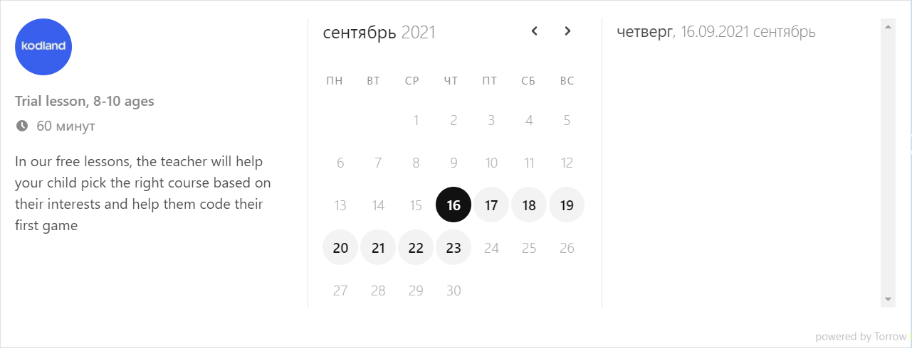
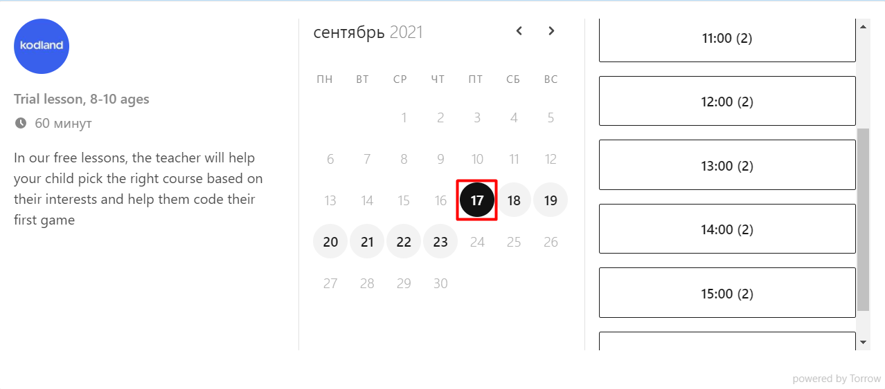
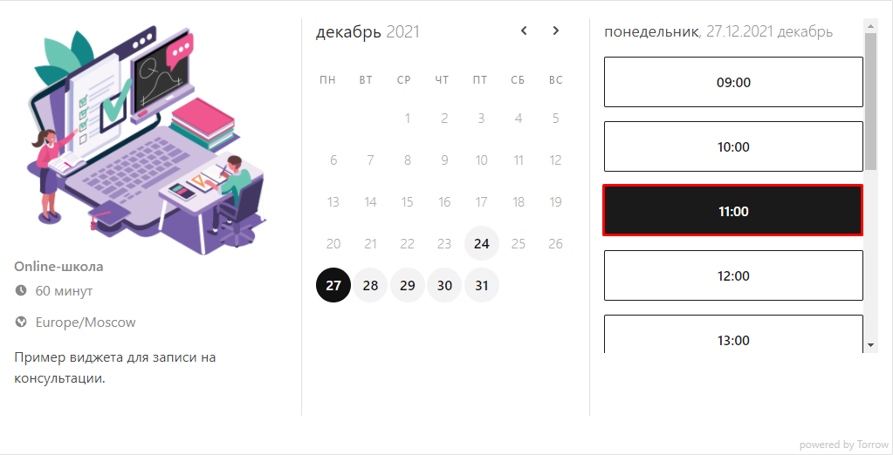
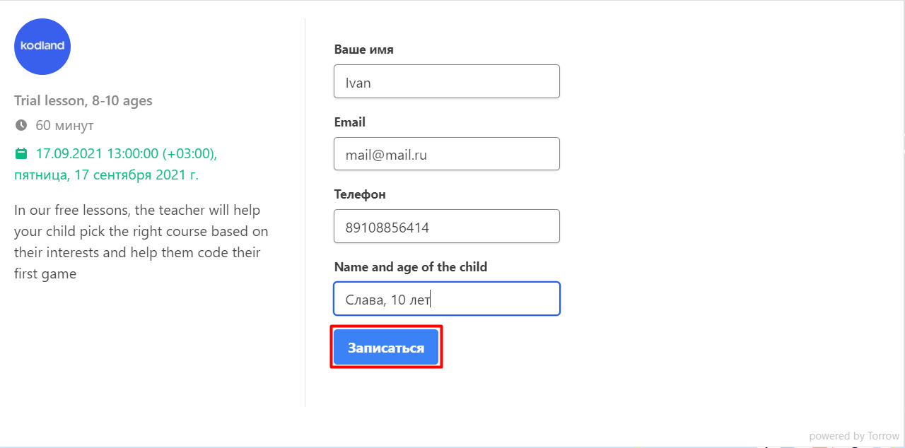
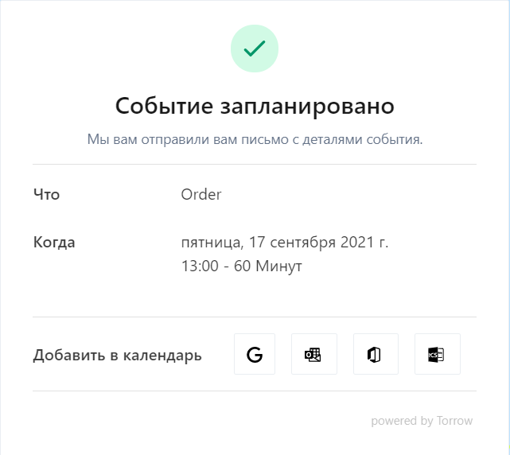
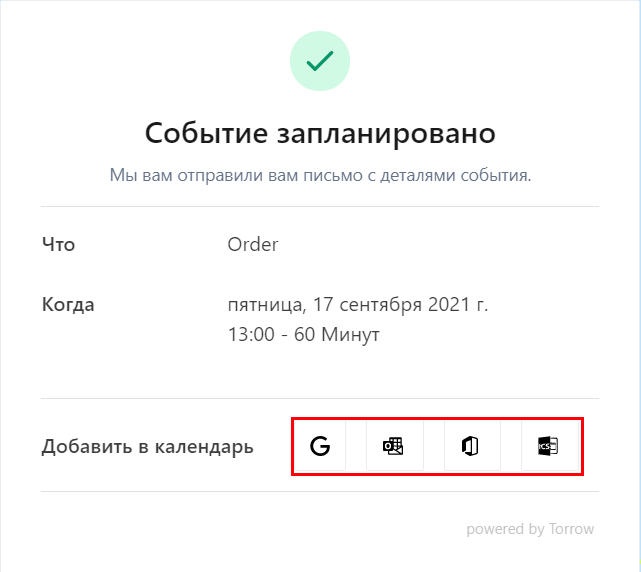
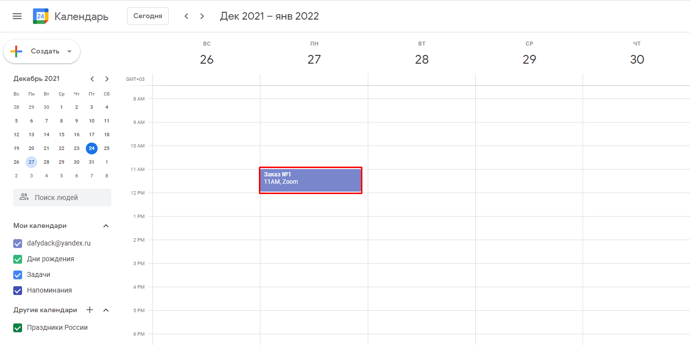

.. _customer-label:

=============================
Подача заявки на Консультацию
=============================

1. Перейдите на по ссылке Online-School_ и зарегистрируйтесь на консультацию по форме ниже.
    .. _Online-School: https://embed.torrow.net/service/103ed611a6b0ddb202018adff7354/booking

--------------------------

2. Выберите подходящую **дату** для проведения **консультации**.

--------------------------

3. Выберите **время** для проведения **консультации**.

--------------------------

4. Заполните свои **контактные данные**, а также по желанию можете оставить **Примечание**. Нажмите на кнопку **Записаться**.

--------------------------

5. **Готово!** Ваши данные переданы менеджеру, после подтверждения заказа Вам поступит информация о проведении консультации на указанный почтовый ящик или телефон.

--------------------------

6. Также Вы можете **добавить событие** в любой **доступный календарь**, для этого нажмите на наиболее подходящий вариант.

--------------------------

7. **Сохраните** событие, нажав на кнопку **Сохранить**.

.. figure:: media/record/mail5.png
    :scale: 42 %
    :alt: alternate text
    :align: center

--------------------------

8. Событие о проведении консультации **заведено** в Вашем выбранном календаре.

----------------------------------