======================
Изменение заявки пользователем (запись через виджет)
======================

1. После того, как Вы записались на консультацию через виджет на сайте онлайн-школы (:ref:`customer-label`), Вам придет письмо на e-mail и/или смс-сообщение.

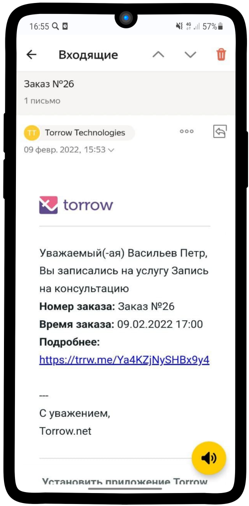

-------------

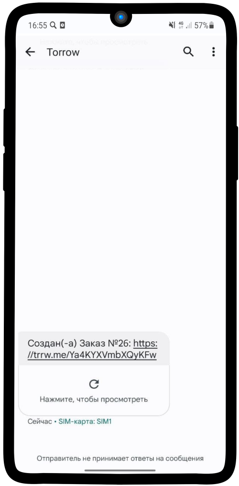

-------------

2. Перейдя по ссылке, Вы можете отслеживать статус своего заказа, подтвердить участие, перенести заказ или отменить участие.
   
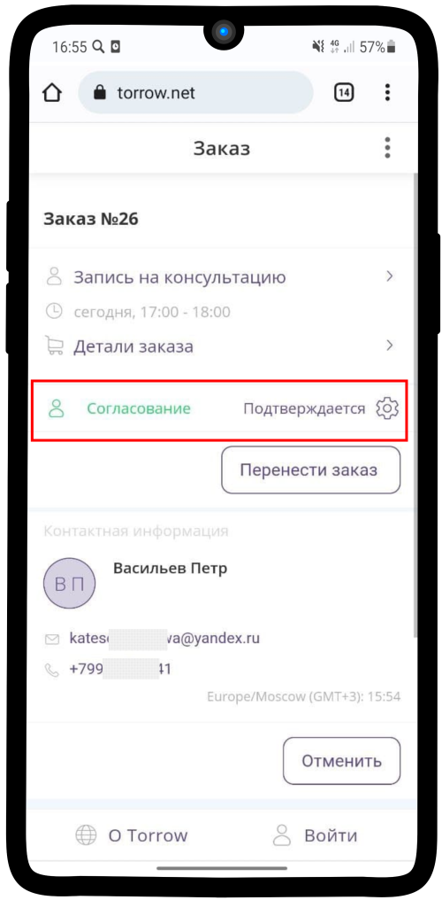

-------------

3. Когда Менеджер возьмет в работу Вашу заявку, то его имя отобразится в деталях заказа |корзина|

    .. |корзина| image:: media/shopping-cart.png
        :scale: 31 %

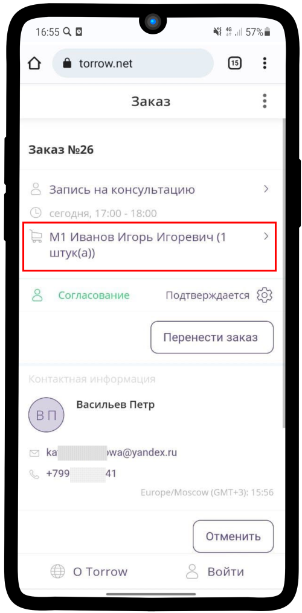

-------------

4. Об изменениях в заказе Вам будут приходить уведомления.

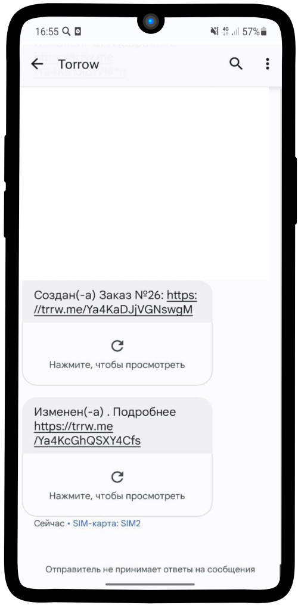

-------------

5. После того, как с Вами свяжется менеджер и передаст заявку дальше в работу, то статус изменится на **Запланировано**

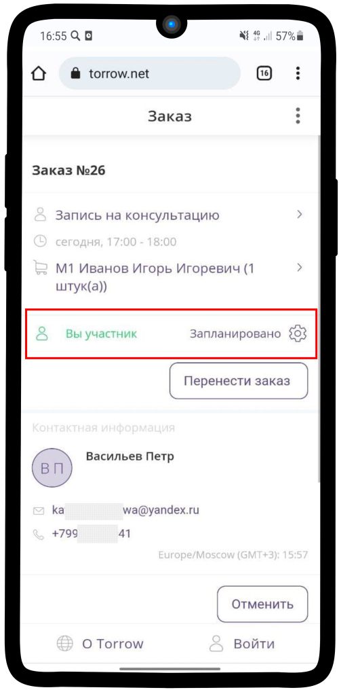

-------------

6. До того, как Консультант возьмет заказ в работу, Вы можете изменить время проведения консультации, нажав на кнопку **Перенести заказ**

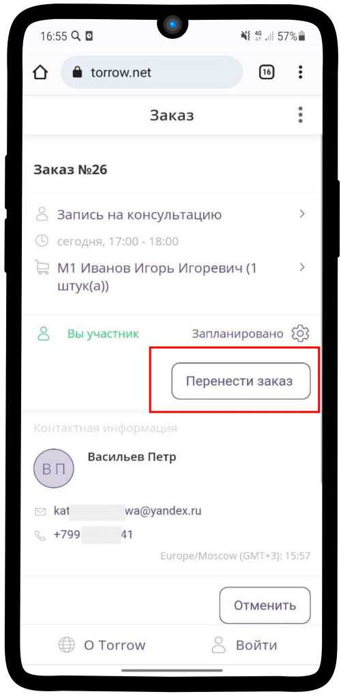

-------------

7. Выберите подходящее Вам свободное время и нажмите на **Подтвердить**

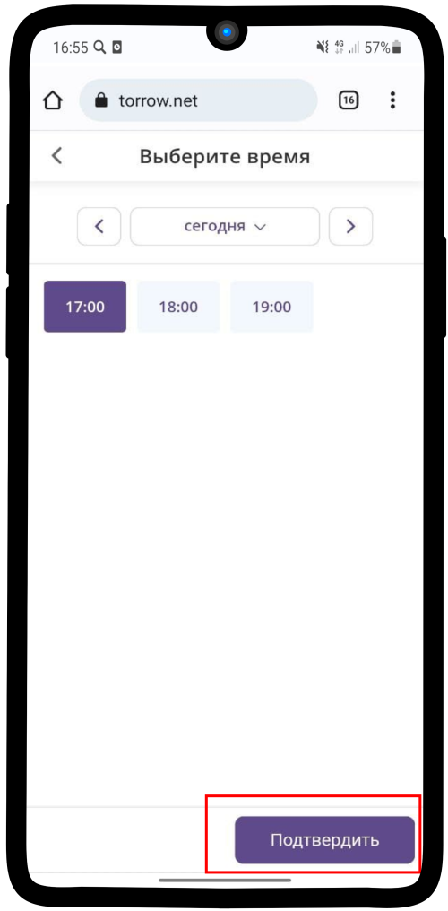

-------------

8. Статус изменится на **В работе**, когда Консультант возьмет заявку в работу

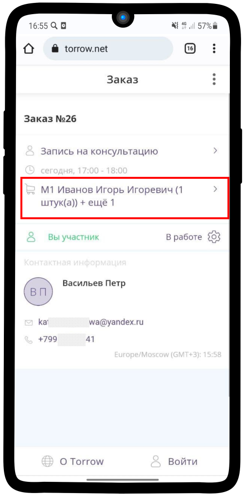

-------------

9. Отменить заказ можно, нажав на Статус заказа |шестеренка| и на **Отменить участие**

    .. |шестеренка| image:: media/nastroy.png
        :scale: 31 %

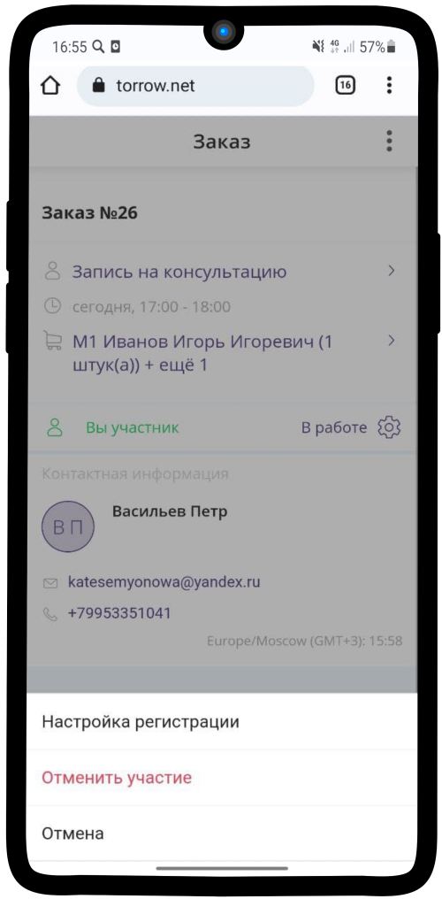

-------------

10. После завершения Консультации Статус заказ поменяется на **Закрыто**

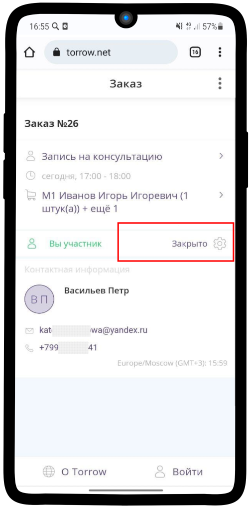

-------------
