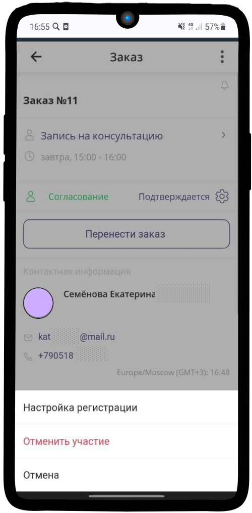
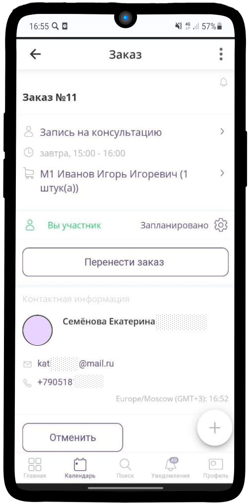
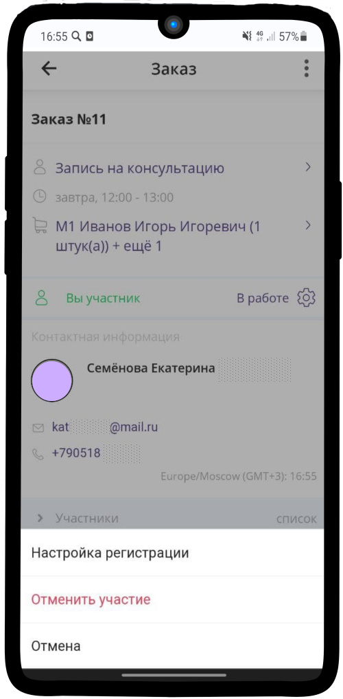

=============================
Изменение заявки пользователем
=============================

Детали заявки
-----------------

1. После того, как Вы **Записались на консультацию**, Вам придет смс со ссылкой на заказ. Нажмите на ссылку:

-------------

2. Так выглядит Ваш заказ до того, как его приняли в работу.

-------------

3. Таким образом он отображается в календаре.

-------------

4. Вы можете изменить свою контактную информацию, нажав на **Подтверждается** |шестеренка| и выберите **Настройка регистрации**

    .. |шестеренка| image:: media/nastroy.png
        :scale: 31 %

-------------

5. Теперь Вы можете проверить или изменить свои данные.

-------------

6. После того, как с Вами связался менеджер и подтвердил **заявку**, Ваш статус поменяется на **Вы участник**, а статус заявки - **Запланировано** |шестеренка|

-------------

7. После подтверждения, заявка передается **консультанту**, статус заявки меняется на **В работе**. В **деталях заказа** |корзина| можно увидеть менеджеров, которые работают с Вашей заявкой.

    .. |корзина| image:: media/shopping-cart.png
        :scale: 31 %

-------------

8. Перед **Консультацией** Вам придет смс с напоминанием.

-------------

Перенос заявки
---------------------- 

1. Если по какой-либо причине Вы не можете присутствовать на **Консультации** в ранее указанное время, то можно перенести заявку на другое время. Нажмите на кнопку **Перенести заказ**.

-------------

2. Выберите удобное **время** для проведения **консультации** и нажмите на **Подтвердить**.

-------------

3. Время проведения Консультации изменилось.

-------------

Отмена заявки
------------------

1. До назначения менеджера-консультанта Вы можете **отменить** заявку, нажав на кнопку **Отменить**.

-------------

2. Статус заказ изменился на **Событие отменено**.

-------------

3. Также Вы можете отменить участие в заявке, нажав на Статус заявки |шестеренка|, выбрать **Отменить участие**.

-------------

4. Появилось уведомление **Участие отменено** и статус заявки изменился на **Событие отменено**.

-------------