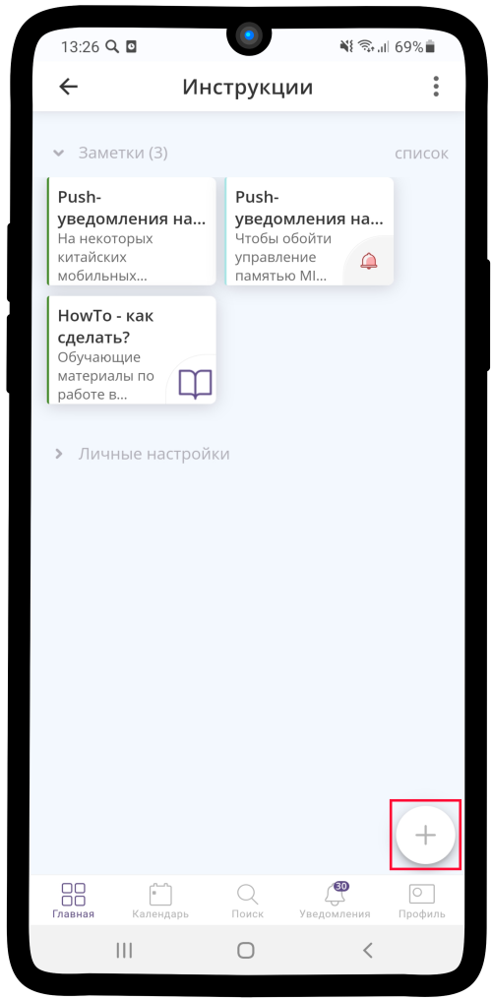
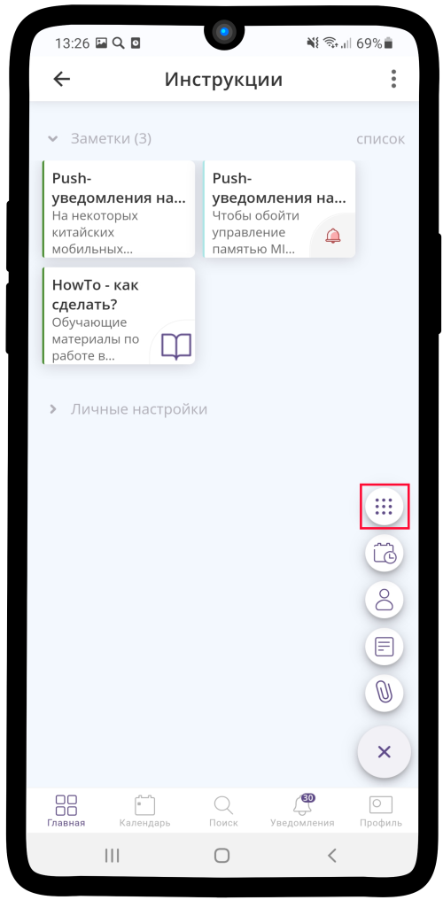
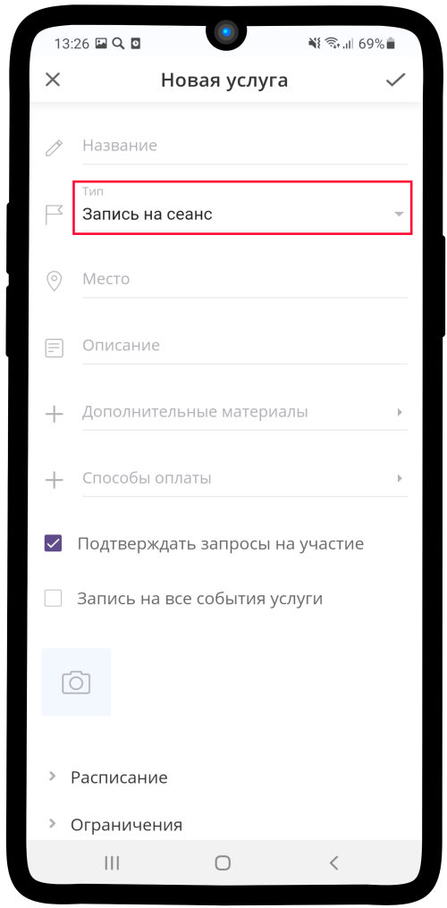
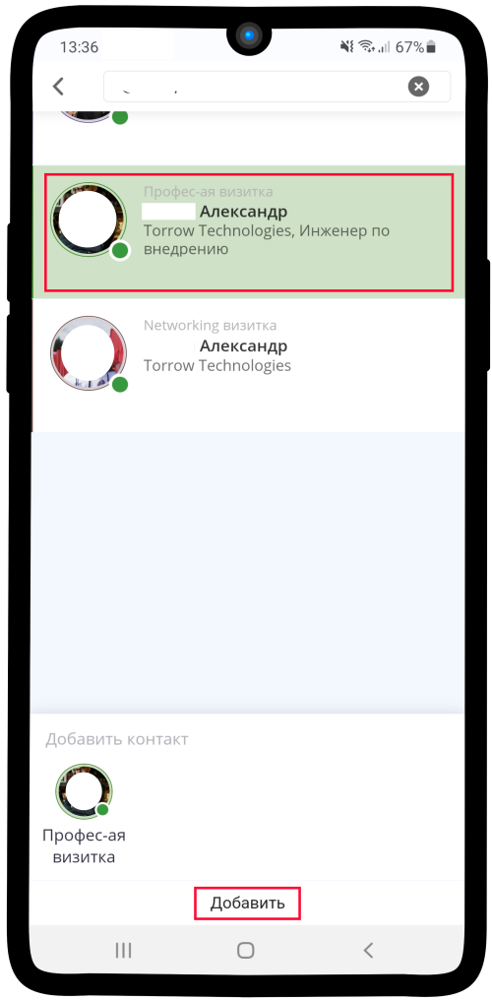
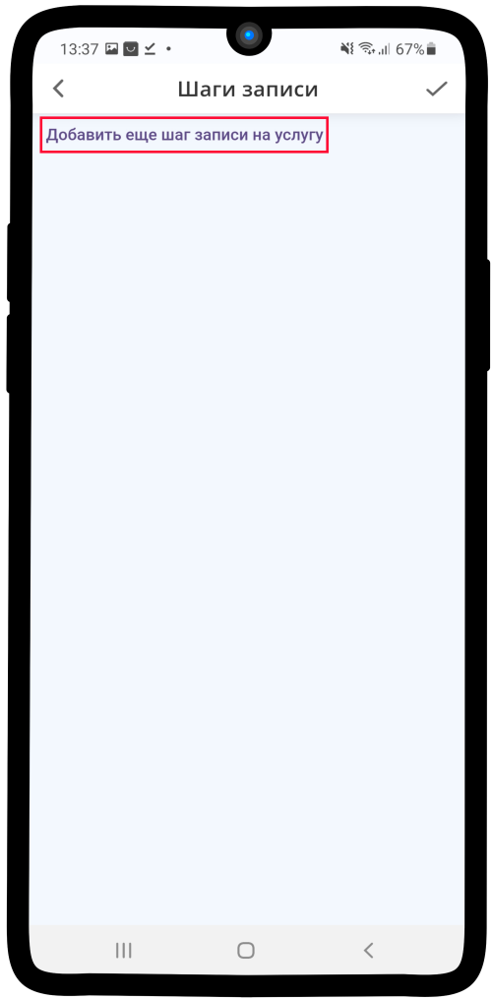
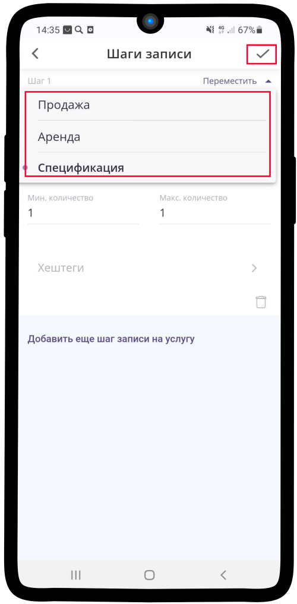
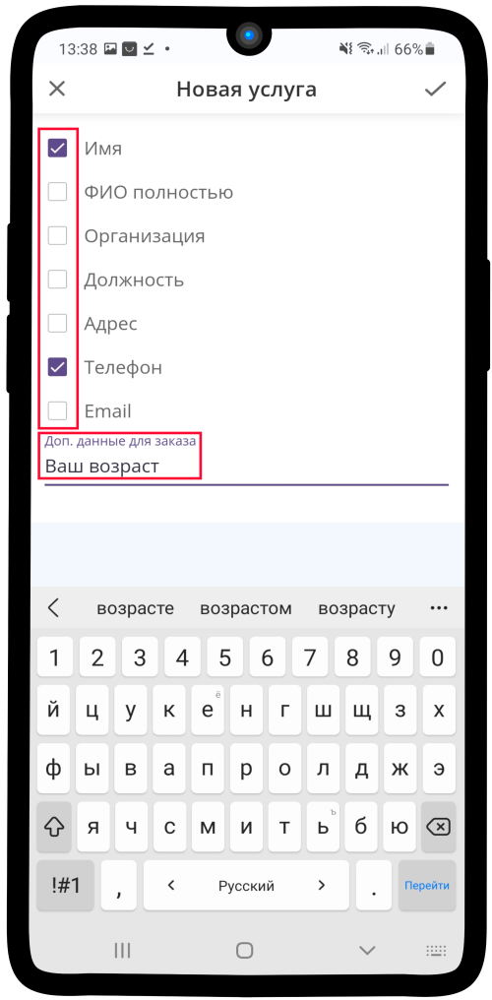
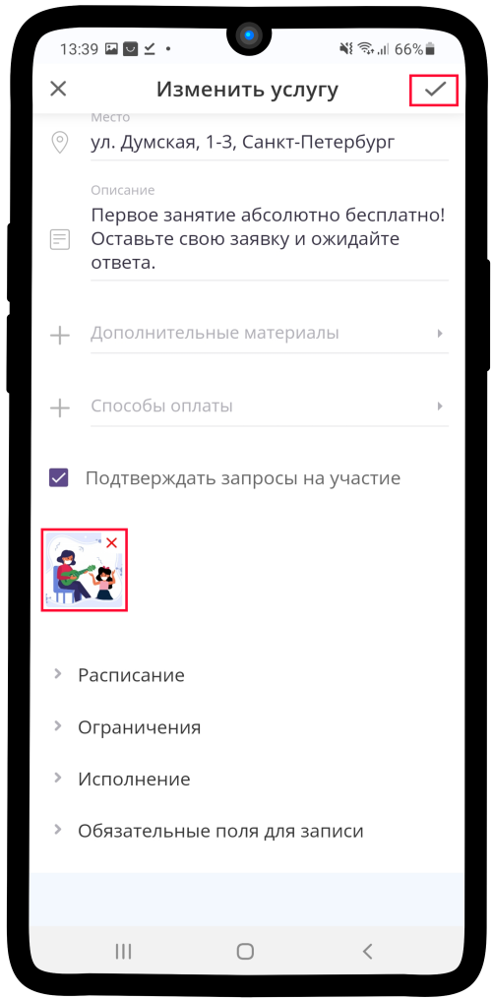

.. _service-label:

Услуга
------

.. note:: **Услуга Torrow** - это элемент, который связывает исполнителей с потенциальными заказчиками. Разместить информацию об услугах может как частное лицо, так и организация. В Torrow предусмотрены следующие виды услуг: `Запись на сеанс`_, `Заявка`_, `Запись на время`_, `Заказ на время`_, `Аренда`_.

Вы можете бесплатно размещать неограниченное количество услуг в разных категориях.

Создание услуги
~~~~~~~~~~~~~~~

Запись на сеанс
"""""""""""""""

---------------------------

Заявка
""""""

1. Зайдите в элемент или раздел, где хотите создать **услугу** и нажмите |плюс|.

    .. |плюс| image:: _static/plus.png
        :scale: 42 %

2. Нажмите на кнопку |массив|.

    .. |массив| image:: _static/reserved.png
        :scale: 42 %

3. Выбираем **Создать услугу** |корзина|.

    .. |корзина| image:: _static/shopping-cart.png
        :scale: 42 %

.. figure:: _static/service/application/application3.png
    :scale: 42 %
    :alt: alternate text
    :align: center

4. Измените **тип**. Для этого нажмите на соответствующее поле (по умолчанию: **Запись на сеанс**).

5. Выберите тип **Заявка**.

.. figure:: _static/service/application/application5.png
    :scale: 42 %
    :alt: alternate text
    :align: center

6. Заполните всю необходимую **информацию об услуге**: название, описание, место.

.. figure:: _static/service/application/application6.png
    :scale: 42 %
    :alt: alternate text
    :align: center

7. Если хотите, чтобы при создании клиентом заявки Вам **приходило уведомление**, то поставьте |галка| в указанное поле.

    .. |галка| image:: _static/galka.png
        :scale: 42 %

.. figure:: _static/service/application/application7.png
    :scale: 42 %
    :alt: alternate text
    :align: center

8. Укажите исполнителя услуги (**ответственное лицо**). Для этого нажмите на поле **Исполнители**.

.. figure:: _static/service/application/application8.png
    :scale: 42 %
    :alt: alternate text
    :align: center

9. В **поисковой строке** введите необходимый контакт. Затем выберите его и нажмите кнопку **Добавить**.
    

10. Нажмите на поле **Шаги записи**.

.. figure:: _static/service/application/application10.png
    :scale: 42 %
    :alt: alternate text
    :align: center

11. Нажмите на поле **Добавить еще шаг записи на услугу**.

.. hint:: Вы можете добавить до 50 шагов записи.

12.   Впишите **название шага записи** в указанное поле. Затем нажмите на **Тип использования**.
   
.. hint:: При использовании услуги данное название будет отображено в верхней части экрана во время выбора **ресурса** (:ref:`resources-label`).

.. figure:: _static/service/application/application12.png
    :scale: 42 %
    :alt: alternate text
    :align: center

13.  Выберите необходимый вариант в зависимости от предполагаемой **услуги** и нажмите |галка|.

.. hint::
    
    * **Продажа** - выбирать в случае, если товар количественно ограничен. Например: игрушки, кулинарные блюда, виды одежды и т.д.
    * **Спецификация** - выбирать в случае, если товар количественно не ограничен. Например: стрижка, услуги тренера, занятие в музыкальной школе и т.д.
    * **Аренда** - выбирать в случае, если товар сдается в аренду на какой-то интервал времени. Напрмер: аренда квартиры, аренда антиквариата, аренда рабочей силы и т.д.

14.   Нажмите на поле **Обязательные поля для записи**.

.. figure:: _static/service/application/application14.png
    :scale: 42 %
    :alt: alternate text
    :align: center

15.   Отметьте необходимые пункты |галка| и укажите **дополнительные данные для заказа** (если они требуются).

16.  Разместите **фотографию** в Вашей **услуге**. Это привлечет больший интерес клиентов. Если все поля заполнены **сохраните изменения**, нажав кнопку |галка|.

17. Ваша услуга типа **заявка** готова! Осталось добавить **ресурсы** (:ref:`resources-label`).

.. figure:: _static/service/application/application17.png
    :scale: 42 %
    :alt: alternate text
    :align: center

------------------------------

Запись на время
"""""""""""""""

Заказ на время
""""""""""""""

Аренда
""""""