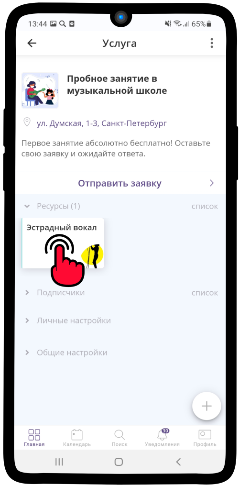
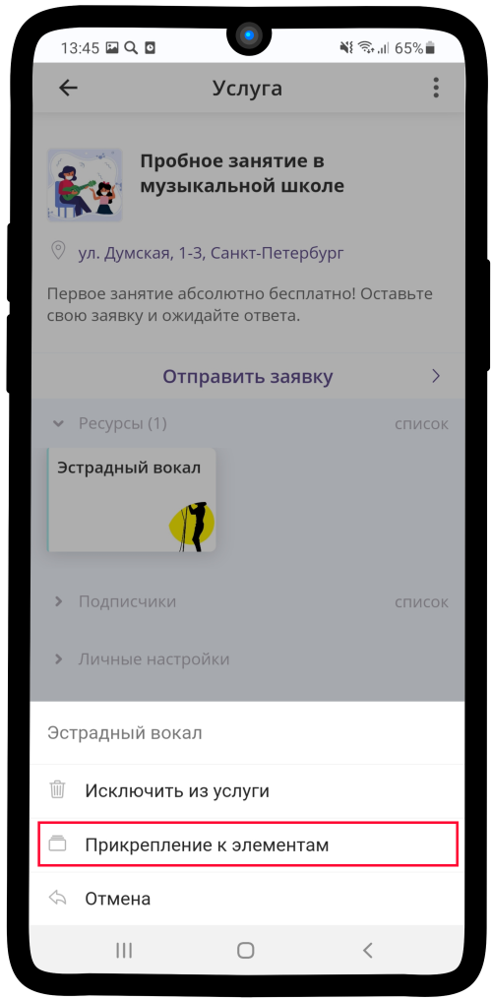
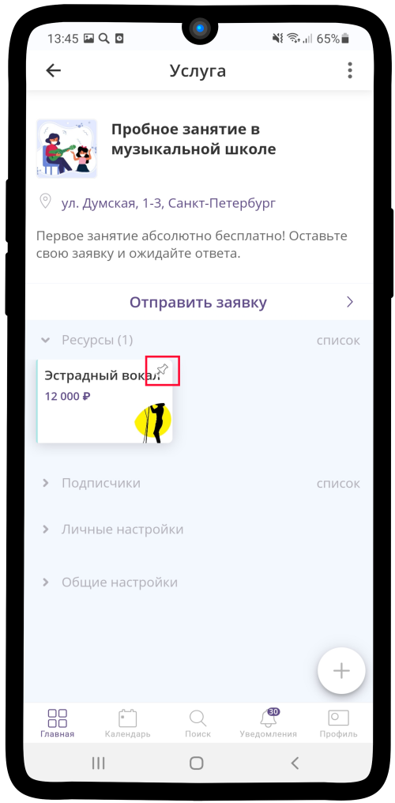

=================================
Как прикреплять вложенный элемент?
=================================

1. Нажмите на элемент и **удерживайте** несколько секунд.

----------------------------------------

2. В появившемся меню выберите **Прикрепление к элементам**.

.. hint:: Если элемент находится **в корне**, например, контакт -> заметка -> заметка, то появится окно, где можно **выбрать за каким элементом, помимо текущего, его закрепить**.

-------------------------------------------------

3. **Готово!** Когда элемент успешно закреплен, **в правом верхнем углу** появится значок |скрепка|.

    .. |скрепка| image:: media/pin-stroke.png
        :scale: 42 %

