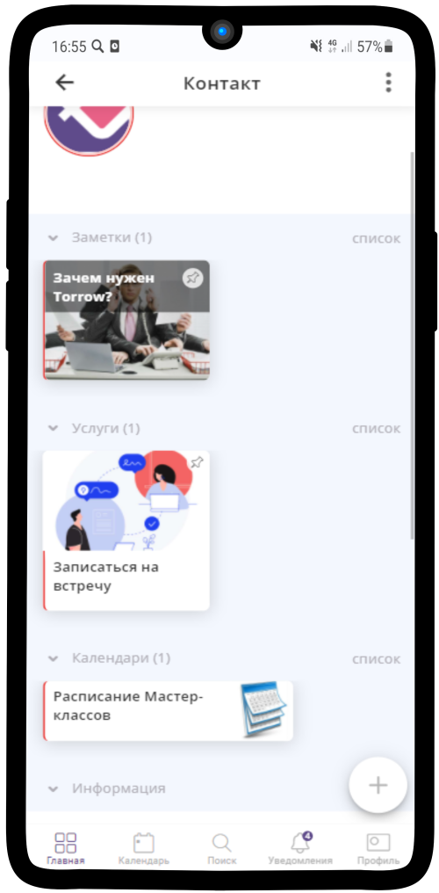
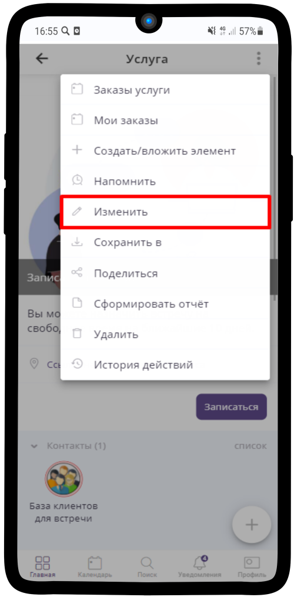
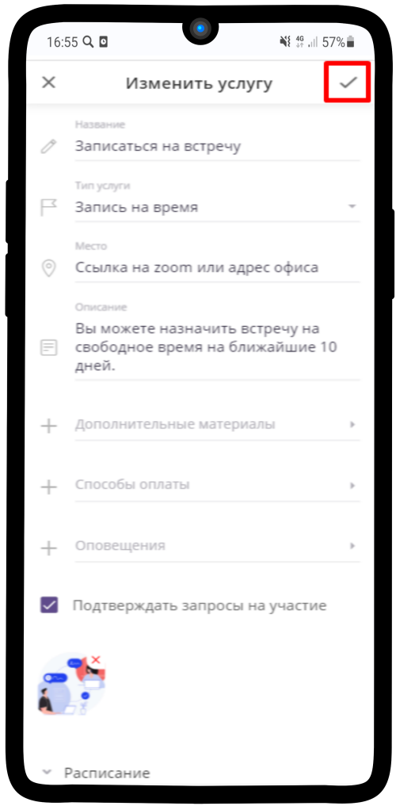

=========================
Как изменить/отредактировать элемент?
=========================

   .. |точка| image:: media/tochka.png
      :width: 21
      :alt: alternative text
   .. |галка| image:: media/galka.png
      :width: 21
      :alt: alternative text

1. Зайдите в нужный элемент

-----------------------

2. Нажмите на |точка|

-----------------------

3. Из выпадающего списка меню выберите **Изменить**

-----------------------

4. Нажмите на |галка|, чтобы сохранить изменения

-----------------------
