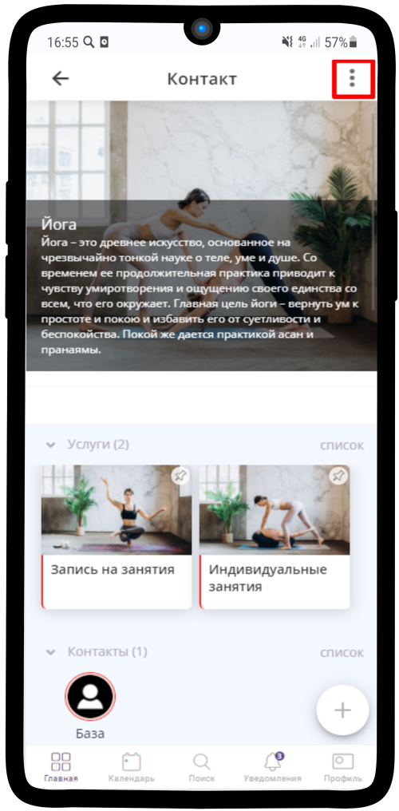
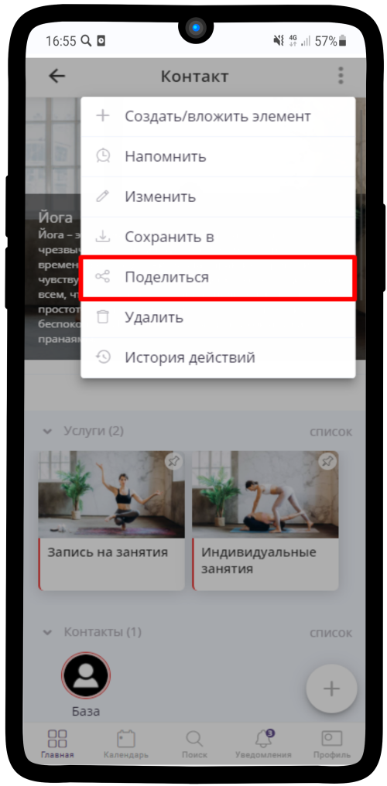
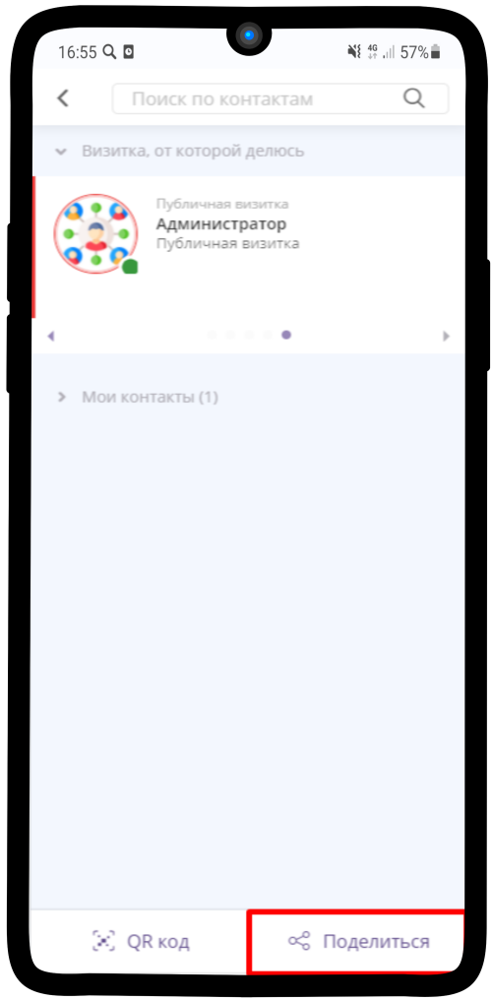
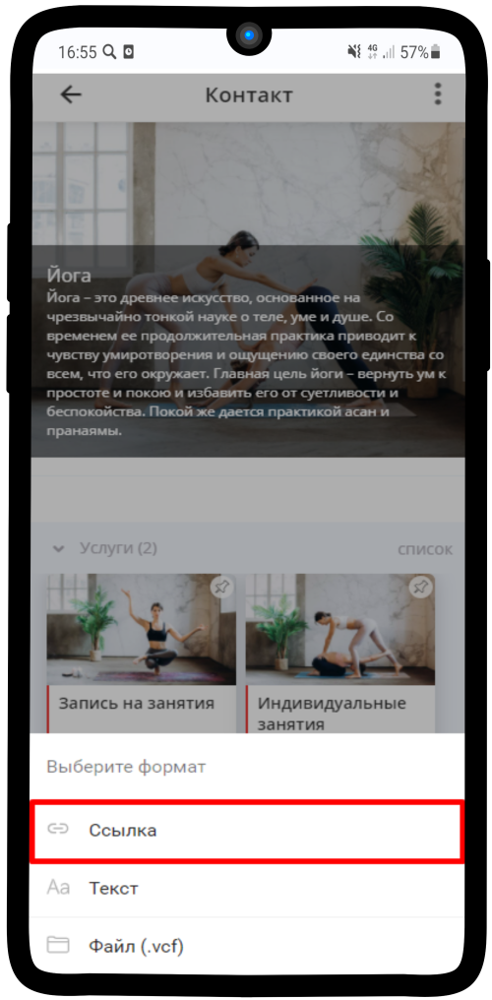
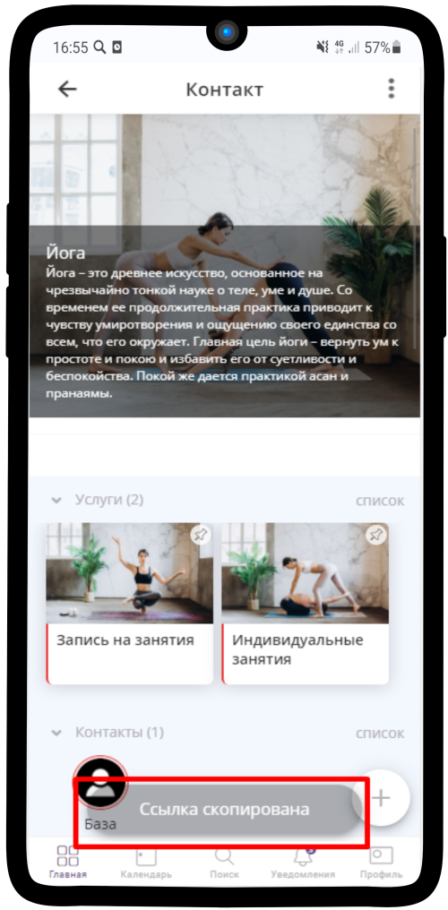
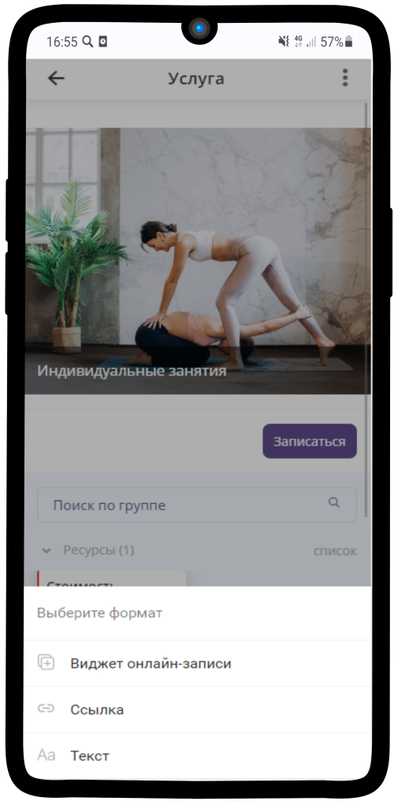

=========================
Как поделиться элементом?
=========================

   .. |точка| image:: media/tochka.png
      :width: 21
      :alt: alternative text

1. Зайдите в нужный элемент и нажмите на |точка|

-----------------------

2. Выберите **Поделиться**

-----------------------

3. В правом нижнем углу нажмите **Поделиться**. Если хотите поделиться элементом с помощью QR-кодам, то выберите **QR-код** 

-----------------------

4. Нажмите **Ссылка**

-----------------------

5. **Ссылка скопирована** в буфер обмена

-----------------------

6. Для **Услуги** можно создать **виджет онлайн-записи**

-----------------------