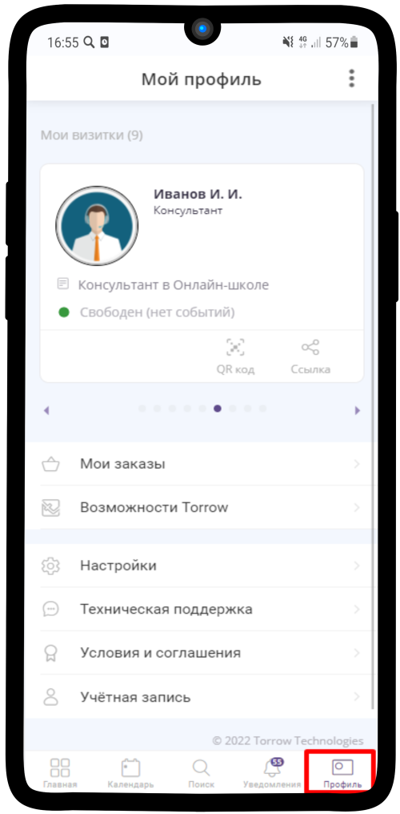
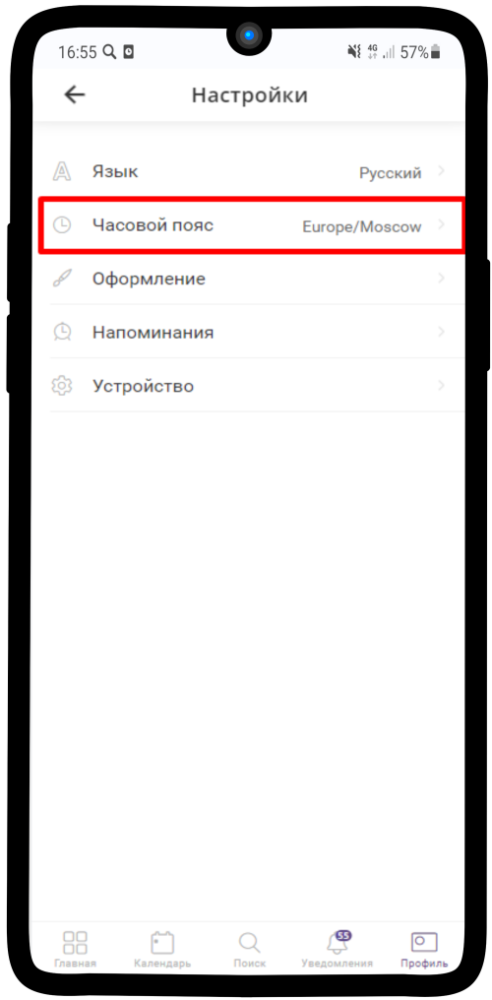
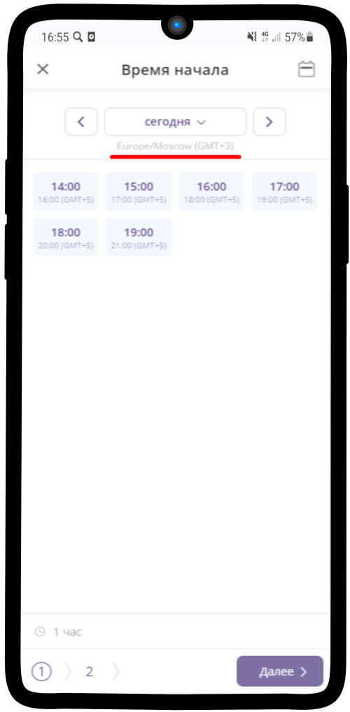
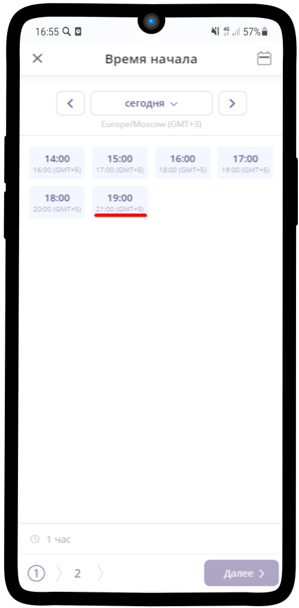
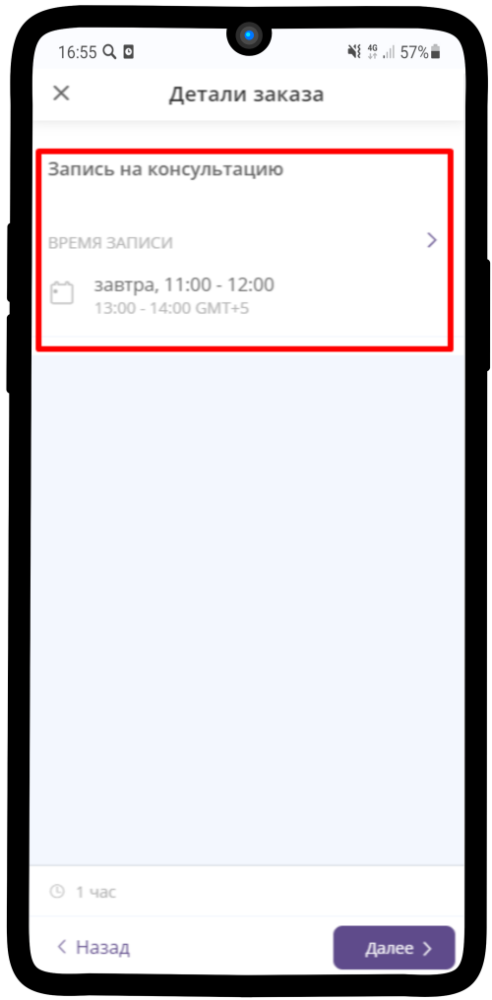

=========================================
Настройка часового пояса пользователя
=========================================

    .. |точка| image:: media/tochka.png
        :scale: 42 %
    .. |профиль| image:: media/profile.png
        :scale: 42 %
    .. |переключатель| image:: media/prin.png
        :scale: 42 %

1. Перейдите в Ваш профиль, нажав на |профиль|

-------------

2. Нажмите на **Настройки**

.. figure:: media/time-zone/time_zone.png
    :scale: 42 %
    :alt: alternate text
    :align: center

-------------

3. Выберите пункт **Часовой пояс**

-------------

4. Нажмите на |переключатель|
   
.. figure:: media/time-zone/time_zone3.png
    :scale: 42 %
    :alt: alternate text
    :align: center

-------------

5. Впишите город, в котором Вы находитесь

.. figure:: media/time-zone/time_zone4.png
    :scale: 42 %
    :alt: alternate text
    :align: center

-------------

6. Теперь при записи на услугу с другим часовым поясом - будет указываться часовой пояс услуги

-------------

7. При выборе времени, на которое записаться, **сверху** показывается **время услуги**, а **снизу - по Вашему часовому поясу**

-------------

8. В деталях заказа также будет указано двойное время

-------------
