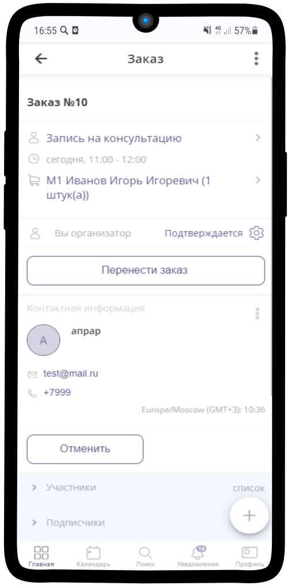

=============================
Получение Заявки для проверки
=============================

1. Зайдите в Ваш ресурс **Менеджера первой линии поддержки**.

----------------------------------

2. Чтобы получить **Заказ**, Вам необходимо нажать на кнопку **Получить заказ**.

.. hint:: Вам будет предложен Заказ, который зарегистрирован не ранее, чем **за 24 часа** до проведения ИК.

----------------------------------

3. После нажатия кнопки **Получить заказ**, Вы увидите информацию о **Заказе** и **Клиенте**. После проверки необходимо **Подтвердить** (:ref:`manager3-label`) или **Отменить** (:ref:`manager4-label`) заказ.

----------------------------------

Связь с клиентом
----------------

.. note:: Вы можете связаться с клиентом и подтвердить его участие в консультации, не покидая приложение.

Чтобы **связаться с клиентом** через приложение Torrow:

1. Нажмите на **контактный номер** клиента.

----------------

2. В раскрывшемся меню выберите подходящий **вариант взаимодействия**. Вы можете **позвонить** или **отправить смс** клиенту через мобильные сервиси, а также связаться с клиентом в **WhatsApp**.

----------------

3. Таким же образом можно связаться с клиентом, нажав на указанный e-mail в контактной информации.
