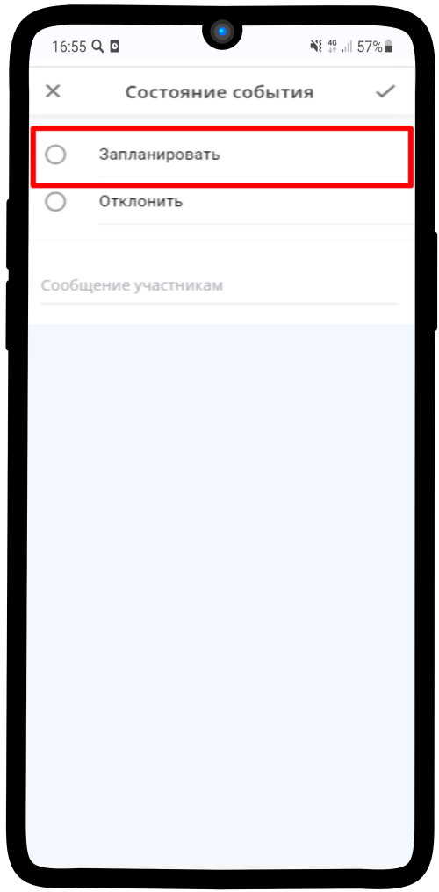

.. _manager3-label:

============================
Подтверждение проведения ИК
============================

1. Чтобы **подтвердить** заказ, нажмите на кнопку **Подтверждается** |шарнир|.
    
    .. |шарнир| image:: media/nastroy.png
        :scale: 42 %

.. figure:: media/order/take6.png
    :scale: 42 %
    :alt: alternate text
    :align: center

2. В появившемся меню выберите **Изменить состояние**.

.. figure:: media/order/take7.png
    :scale: 42 %
    :alt: alternate text
    :align: center

3. Выберите **Запланировать** и нажмите |галка|.

    .. |галка| image:: media/galka.png
        :scale: 42 %

4. **Готово!** Статус данного заказа изменен на **Запланировано** и будет передан в работу Менеджеру индивидуальной консультации.

.. figure:: media/order/take9.png
    :scale: 42 %
    :alt: alternate text
    :align: center

-------------------------------