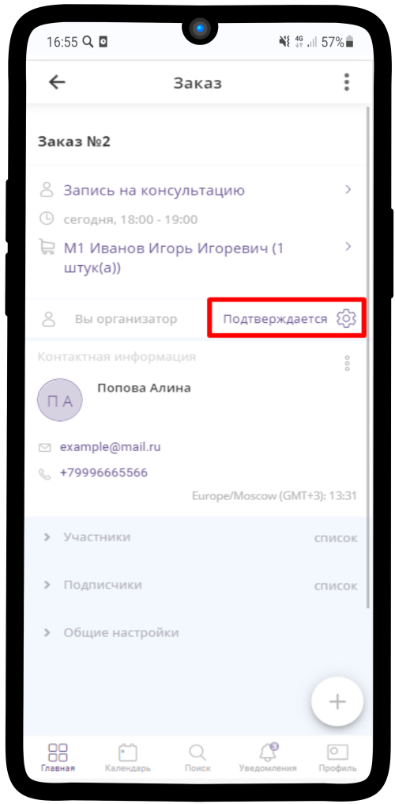
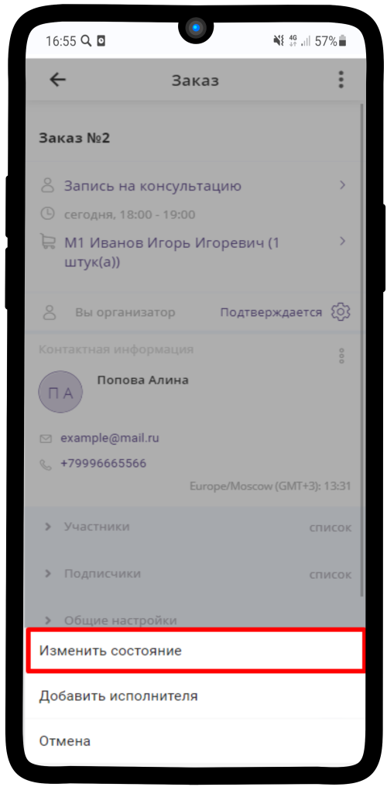
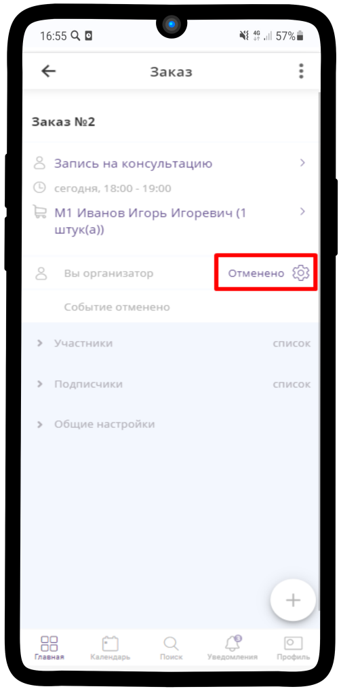

.. _manager4-label:

=====================
Отмена проведения Консультации
=====================

1. Чтобы **отменить** заказ, нажмите на кнопку **Подтверждается** |шарнир|.
    
    .. |шарнир| image:: media/nastroy.png
        :scale: 42 %

--------------------------

2. В появившемся меню выберите **Изменить состояние**.

--------------------------

3. Выберите **Отклонить** и нажмите |галка|.

    .. |галка| image:: media/galka.png
        :scale: 42 %

.. hint:: Если необходимо отправить сообщение клиенту при отмене заявки, просто введите его в поле **Сообщение участникам**.

.. figure:: media/order/order_m7.png
    :scale: 42 %
    :alt: alternate text
    :align: center

--------------------------

4. Статус данного заказа изменен на **Отменено**.

--------------------------